## Лабораторная работа. Настройка расширенных сетей VLAN, VTP и DTP

### Топология

### Таблица адресации

|Заголовок таблицы	|Интерфейс |IP-адрес	   |Маска подсети|
|:------------------|:---------|:------------|:------------|
|S1	                |VLAN 99	 |192.168.99.1 |255.255.255.0|
|S2	                |VLAN 99	 |192.168.99.2 |255.255.255.0|
|S3	                |VLAN 99	 |192.168.99.3 |255.255.255.0|
|PC-A	              |NIC	     |192.168.10.1 |255.255.255.0|
|PC-B	              |NIC	     |192.168.20.1 |255.255.255.0|
|PC-C               |NIC	     |192.168.10.2 |255.255.255.0|

###  Задание:
1. Настройка VTP
2. Настройка DTP
3. Добавление сетей VLAN и назначение портов
4. Настройка расширенной сети VLAN

###  Часть 1 Настройка VTP
##### Коммутатор S2
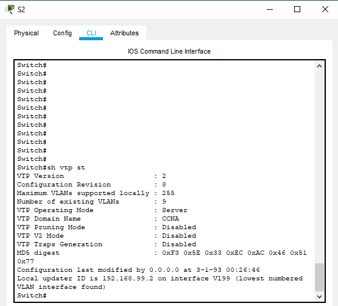
##### Коммутатор S1 и S3
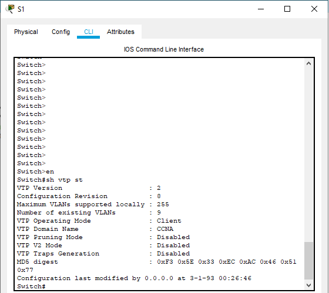
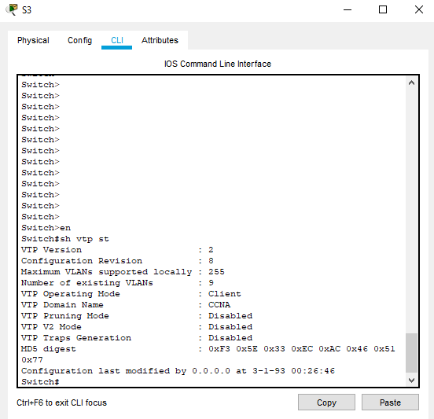

###  Часть 2	Настройка динамического протокола транкинга (DTP)
show interfaces f0/1 switchport
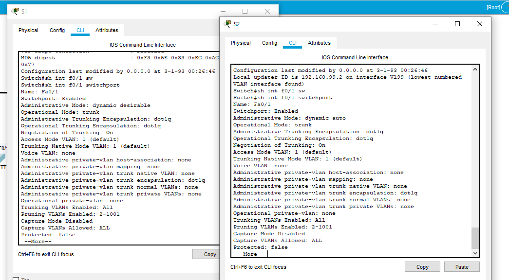

show interface trunk
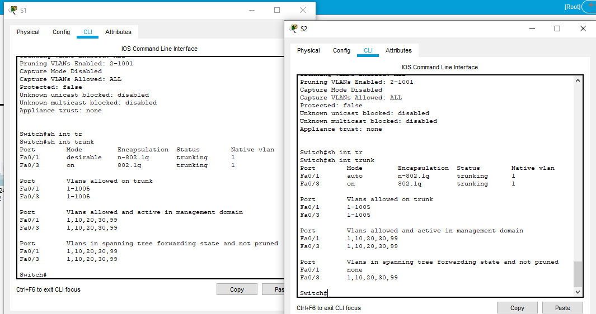
##### Шаг 2:	Настройка статический магистральный канал между S2 и S3
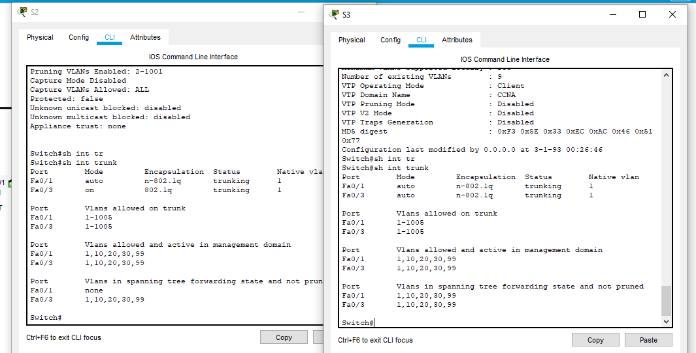
Использованные команды:
S3: Conf t, int f0/18, sw mode tr
S2: Conf t, int f0/3, sw mode tr

### Часть 3:	Добавление сетей VLAN и назначение портов
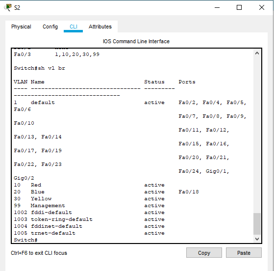

##### Шаг 2:	Проверьте обновления VTP на коммутаторах S1 и S3
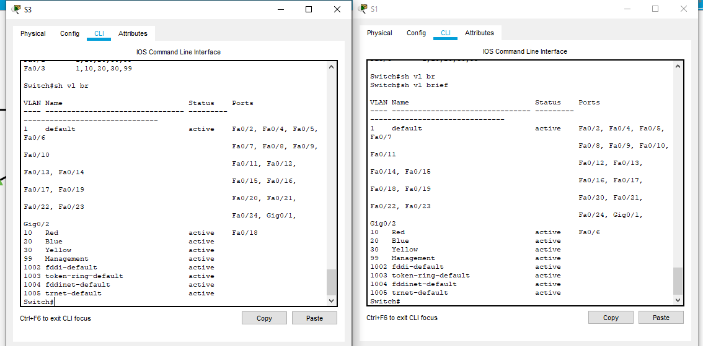

##### Шаг 5:	Проверьте наличие сквозного соединения
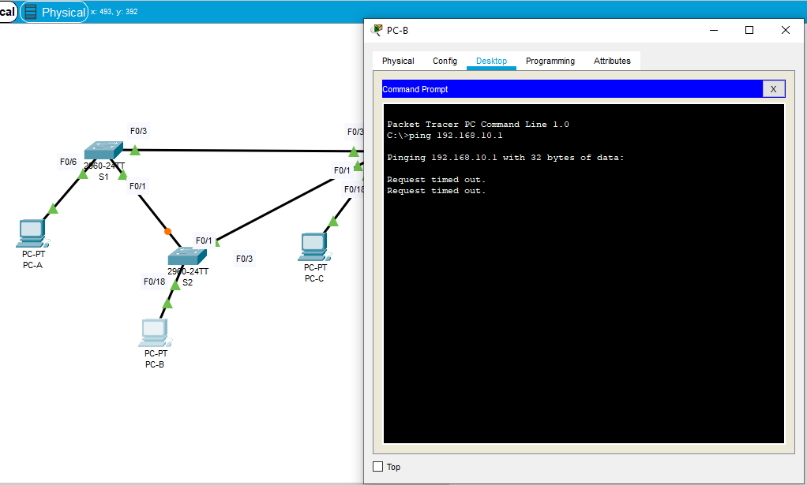
Эхо-запросы не проходят. Компьютер PC-B находится в другом VLAN

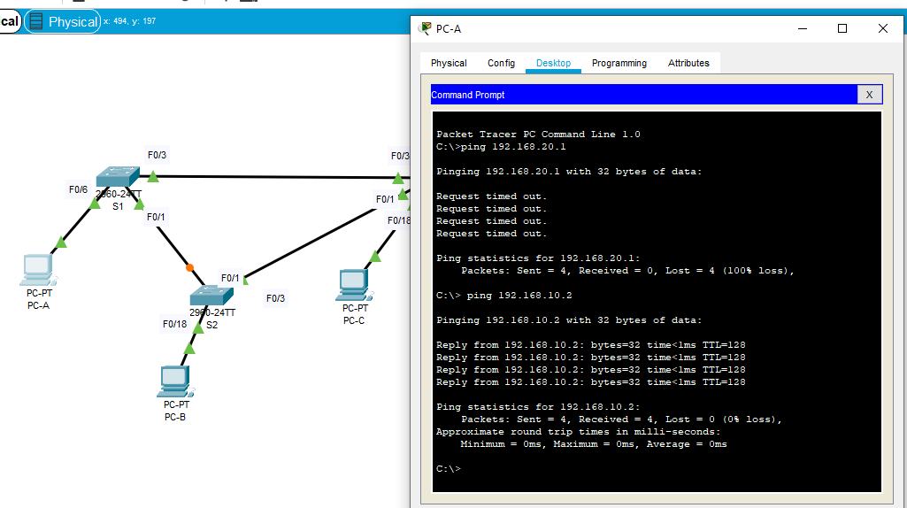
Эхо-запросы проходят.

##### Отправьте ping-запрос с коммутатора S1 на компьютер PC-A. Была ли проверка успешной? Поясните ответ.
Проверка не была успешной. Пинг-запрос осуществлялся с SVI-интерфейса управления, адрес которого принадлежит другой сети 

##### Отправьте ping-запрос с коммутатора S2 на коммутатор S1. Была ли проверка успешной? Поясните ответ.
Проверка была успешной. SVI-интерфейсы обоих коммутаторов имею адреса из одной сети.

### Часть 4:	Настройка сети VLAN расширенного диапазона

##### Шаг 1:	Переведите VTP на коммутаторе S1 в прозрачный режим

##### Шаг 2:	Настройте сеть VLAN расширенного диапазона на коммутаторе S1

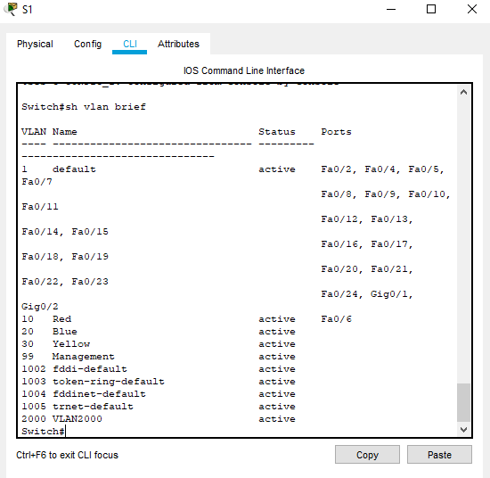
