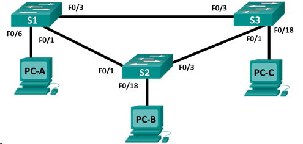

## Лабораторная работа. Настройка расширенных сетей VLAN, VTP и DTP

### Топология

###  Задание:
1. Настройка VTP
2. Настройка DTP
3. Добавление сетей VLAN и назначение портов
4. Настройка расширенной сети VLAN
