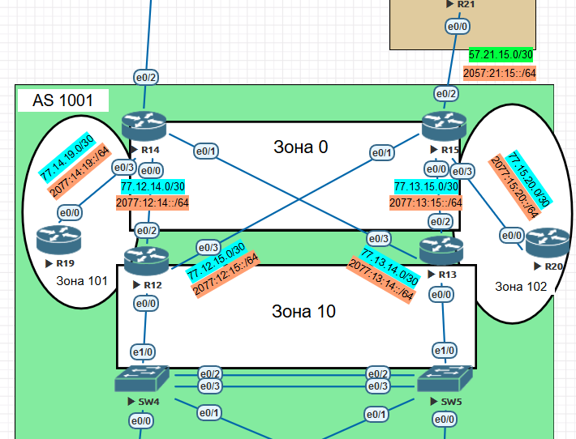

# Различные виды фильтрации в протоколе OSPF

## Топология

## Адресация

| Host | Discription | Interface | IPv4          | IPv6             | Link-local |
|------|-------------|-----------|---------------|------------------|------------|
| R12  | toR14       | e0/2      | 77.12.14.1/30 | 2077:12:14::1/64 | FE80::12   |
| R12  | toR15       | e0/3      | 77.12.15.1/30 | 2077:12:15::1/64 |            |
| R13  | toR15       | e0/2      | 77.13.15.1/30 | 2077:13:15::1/64 | FE80::13   |
| R13  | toR14       | e0/3      | 77.13.14.1/30 | 2077:13:14::1/64 |            |
| R14  | toR12       | e0/0      | 77.12.14.2/30 | 2077:12:14::2/64 | FE80::14   |
| R14  | toR13       | e0/1      | 77.13.14.2/30 | 2077:13:14::2/64 |            |
| R14  | toR19       | e0/3      | 77.14.19.1/30 | 2077:14:19::1/64 |            |
| R15  | toR13       | e0/0      | 77.13.15.2/30 | 2077:13:15::2/64 | FE80::15   |
| R15  | toR12       | e0/1      | 77.12.15.2/30 | 2077:12:15::2/64 |            |
| R15  | toR20       | e0/3      | 77.15.20.1/30 | 2077:15:20::1/64 |            |
| R19  | toR14       | e0/0      | 77.14.19.2/30 | 2077:14:19::2/64 | FE80::19   |
| R20  | toR15       | e0/0      | 77.15.20.2/30 | 2077:15:20::2/64 | FE80::20   |

## Задачи

1. Маршрутизаторы R14-R15 находятся в зоне 0 - backbone
2. Маршрутизаторы R12-R13 находятся в зоне 10. Допол-но к маршрутам должны получать маршрут по-умолчанию
3. Маршрутизатор R19 находится в зоне 101 и получает только маршрут по умолчанию
4. Маршрутизатор R20 находится в зоне 102 и получает все маршруты, кроме маршрутов до сетей зоны 101
5. План работы и изменения зафиксированы в документации 

## Настройки маршутизаторов

### Маршрутизаторы R14-R15 находятся в зоне 0 - backbone

Интерфейсы e0/0, e0/1 маршрутизаторов R14-R15 находятся в area 0. Интерфейсы e0/3 маршрутиаторов R14 и R15 находятся в зонах 101 и 102 соответственно

### Маршрутизатор R14
  
     interface Ethernet0/0
     ip address 77.12.14.2 255.255.255.252
     ipv6 address FE80::14 link-local
     ipv6 address 2077:12:14::2/64
     ipv6 ospf 1 area 0
    !
    interface Ethernet0/1
     ip address 77.13.14.2 255.255.255.252
     ipv6 address FE80::14 link-local
     ipv6 address 2077:13:14::2/64
     ipv6 ospf 1 area 0
    !
    interface Ethernet0/3
     ip address 77.14.19.1 255.255.255.252
     ipv6 address FE80::14 link-local
     ipv6 address 2077:14:19::1/64
     ipv6 ospf 1 area 101
    !
    router ospf 1
     router-id 14.14.14.14
     area 101 stub no-summary
     network 77.12.14.0 0.0.0.3 area 0
     network 77.13.14.0 0.0.0.3 area 0
     network 77.14.19.0 0.0.0.3 area 101
    !
    ipv6 router ospf 1
     router-id 14.14.14.14
     area 101 stub no-summary
     
    ********************************таблица маршрутизации IPv4***********************
     
    O*E2  0.0.0.0/0 [110/1] via 77.13.14.1, 05:22:21, Ethernet0/1
                    [110/1] via 77.12.14.1, 05:22:21, Ethernet0/0
          77.0.0.0/8 is variably subnetted, 9 subnets, 2 masks
    O        77.12.15.0/30 [110/20] via 77.12.14.1, 05:22:21, Ethernet0/0
    O        77.13.15.0/30 [110/20] via 77.13.14.1, 05:22:21, Ethernet0/1
    O IA     77.15.20.0/30 [110/30] via 77.13.14.1, 05:16:29, Ethernet0/1
                           [110/30] via 77.12.14.1, 05:16:29, Ethernet0/0
    O IA  172.16.0.0/16 [110/20] via 77.13.14.1, 05:22:21, Ethernet0/1
                        [110/20] via 77.12.14.1, 05:22:21, Ethernet0/0
          192.168.1.0/32 is subnetted, 1 subnets
    O        192.168.1.254 [110/11] via 77.14.19.2, 05:22:11, Ethernet0/3
    R14#

    ********************************таблица маршрутизации IPv6***********************
    
    OE2 ::/0 [110/1], tag 1
         via FE80::13, Ethernet0/1
         via FE80::12, Ethernet0/0
    O   2077:12:15::/64 [110/20]
         via FE80::12, Ethernet0/0
    O   2077:13:15::/64 [110/20]
         via FE80::13, Ethernet0/1
    OI  2077:15:20::/64 [110/30]
         via FE80::13, Ethernet0/1
         via FE80::12, Ethernet0/0

### Маршрутизатор R15

     interface Ethernet0/0
     ip address 77.13.15.2 255.255.255.252
     ipv6 address FE80::15 link-local
     ipv6 address 2077:13:15::2/64
     ipv6 ospf 1 area 0
    !
    interface Ethernet0/1
     ip address 77.12.15.2 255.255.255.252
     ipv6 address FE80::15 link-local
     ipv6 address 2077:12:15::2/64
     ipv6 ospf 1 area 0
    !
    interface Ethernet0/2
     ip address 57.21.15.2 255.255.255.252
     ipv6 address FE80::15 link-local
     ipv6 address 2057:21:15::2/64
    !
    interface Ethernet0/3
     ip address 77.15.20.1 255.255.255.252
     ipv6 address FE80::15 link-local
     ipv6 address 2077:15:20::1/64
     ipv6 ospf 1 area 102
    !
    router ospf 1
     router-id 15.15.15.15
     area 102 filter-list prefix DENYAREA101 in
     redistribute static subnets
     network 77.12.15.0 0.0.0.3 area 0
     network 77.13.15.0 0.0.0.3 area 0
     network 77.15.20.0 0.0.0.3 area 102
     default-information originate

    ip route 0.0.0.0 0.0.0.0 57.21.15.1
    !
    ip prefix-list DENYAREA101 seq 5 deny 77.14.19.0/30
    ip prefix-list DENYAREA101 seq 10 permit 0.0.0.0/0 le 32
    ipv6 route ::/0 2057:21:15::1
    ipv6 router ospf 1
     router-id 15.15.15.15
     distribute-list prefix-list DENY101 in
     default-information originate
    !
    ipv6 prefix-list DENY101 seq 5 deny 2077:14:19::/64
    ipv6 prefix-list DENY101 seq 15 permit ::/0 le 128

    ********************************таблица маршрутизации IPv4***********************
    R15#sh ip route ospf
    Gateway of last resort is 57.21.15.1 to network 0.0.0.0
          77.0.0.0/8 is variably subnetted, 9 subnets, 2 masks
    O        77.12.14.0/30 [110/20] via 77.12.15.1, 05:19:01, Ethernet0/1
    O        77.13.14.0/30 [110/20] via 77.13.15.1, 05:19:01, Ethernet0/0
    O IA     77.14.19.0/30 [110/30] via 77.13.15.1, 05:19:01, Ethernet0/0
                           [110/30] via 77.12.15.1, 05:19:01, Ethernet0/1
    O IA  172.16.0.0/16 [110/20] via 77.13.15.1, 05:19:01, Ethernet0/0
                        [110/20] via 77.12.15.1, 05:19:01, Ethernet0/1
          192.168.1.0/32 is subnetted, 1 subnets
    O IA     192.168.1.254 [110/31] via 77.13.15.1, 05:19:01, Ethernet0/0
                           [110/31] via 77.12.15.1, 05:19:01, Ethernet0/1
    ********************************таблица маршрутизации IPv6***********************
    O   2077:12:14::/64 [110/20]
         via FE80::12, Ethernet0/1
    O   2077:13:14::/64 [110/20]
         via FE80::13, Ethernet0/0

### Маршрутизаторы R12-R13 находятся в зоне 10. Допол-но к маршрутам должны получать маршрут по-умолчанию

### Маршрутизатор R12

    interface Ethernet0/0
     ip address 172.16.0.12 255.255.0.0
     standby version 2
     standby 1 ip 172.16.0.1
     standby 1 priority 150
     standby 1 preempt
    !
    interface Ethernet0/2
     ip address 77.12.14.1 255.255.255.252
     ipv6 address FE80::12 link-local
     ipv6 address 2077:12:14::1/64
     ipv6 ospf 1 area 0
    !
    interface Ethernet0/3
     ip address 77.12.15.1 255.255.255.252
     ipv6 address FE80::12 link-local
     ipv6 address 2077:12:15::1/64
     ipv6 ospf 1 area 0
    !
    router ospf 1
     router-id 12.12.12.12
     area 10 stub
     network 77.12.14.0 0.0.0.3 area 0
     network 77.12.15.0 0.0.0.3 area 0
     network 172.16.0.0 0.0.0.255 area 10
    !
    ipv6 router ospf 1
     router-id 12.12.12.12
     area 10 stub

    ********************************таблица маршрутизации IPv4***********************
    O*E2  0.0.0.0/0 [110/1] via 77.12.15.2, 06:11:31, Ethernet0/3
          77.0.0.0/8 is variably subnetted, 8 subnets, 2 masks
    O        77.13.14.0/30 [110/20] via 77.12.14.2, 06:27:46, Ethernet0/2
    O        77.13.15.0/30 [110/20] via 77.12.15.2, 1d19h, Ethernet0/3
    O IA     77.14.19.0/30 [110/20] via 77.12.14.2, 05:14:03, Ethernet0/2
    O IA     77.15.20.0/30 [110/20] via 77.12.15.2, 05:08:21, Ethernet0/3
          192.168.1.0/32 is subnetted, 1 subnets
    O IA     192.168.1.254 [110/21] via 77.12.14.2, 05:14:03, Ethernet0/2

    ********************************таблица маршрутизации IPv6***********************
    OE2 ::/0 [110/1], tag 1
         via FE80::15, Ethernet0/3
    O   2077:13:14::/64 [110/20]
         via FE80::14, Ethernet0/2
    O   2077:13:15::/64 [110/20]
         via FE80::15, Ethernet0/3
    OI  2077:14:19::/64 [110/20]
         via FE80::14, Ethernet0/2
    OI  2077:15:20::/64 [110/20]
         via FE80::15, Ethernet0/3
         
         
 ### Маршрутизатор R13

    interface Ethernet0/0
     ip address 172.16.0.13 255.255.0.0
     standby version 2
     standby 1 ip 172.16.0.1
    !
    interface Ethernet0/2
     ip address 77.13.15.1 255.255.255.252
     ipv6 address FE80::13 link-local
     ipv6 address 2077:13:15::1/64
     ipv6 ospf 1 area 0
    !
    interface Ethernet0/3
     ip address 77.13.14.1 255.255.255.252
     ipv6 address FE80::13 link-local
     ipv6 address 2077:13:14::1/64
     ipv6 ospf 1 area 0
    !
    router ospf 1
     router-id 13.13.13.13
     area 10 stub
     network 77.13.14.0 0.0.0.3 area 0
     network 77.13.15.0 0.0.0.3 area 0
     network 172.16.0.0 0.0.255.255 area 10
    !
    ipv6 router ospf 1
     router-id 13.13.13.13
     area 10 stub
     ********************************таблица маршрутизации IPv4***********************
    O*E2  0.0.0.0/0 [110/1] via 77.13.15.2, 06:35:37, Ethernet0/2
          77.0.0.0/8 is variably subnetted, 8 subnets, 2 masks
    O        77.12.14.0/30 [110/20] via 77.13.14.2, 06:51:51, Ethernet0/3
    O        77.12.15.0/30 [110/20] via 77.13.15.2, 1d19h, Ethernet0/2
    O IA     77.14.19.0/30 [110/20] via 77.13.14.2, 05:38:08, Ethernet0/3
    O IA     77.15.20.0/30 [110/20] via 77.13.15.2, 05:32:26, Ethernet0/2
          192.168.1.0/32 is subnetted, 1 subnets
    O IA     192.168.1.254 [110/21] via 77.13.14.2, 05:38:08, Ethernet0/3
    ********************************таблица маршрутизации IPv4***********************
    OE2 ::/0 [110/1], tag 1
         via FE80::15, Ethernet0/2
    O   2077:12:14::/64 [110/20]
         via FE80::14, Ethernet0/3
    O   2077:12:15::/64 [110/20]
         via FE80::15, Ethernet0/2
    OI  2077:14:19::/64 [110/20]
         via FE80::14, Ethernet0/3
    OI  2077:15:20::/64 [110/20]
         via FE80::15, Ethernet0/2
         
         
 ### Маршрутизатор R19 находится в зоне 101 и получает только маршрут по умолчанию        
         
 ### Маршрутизатор R19

    interface Loopback1
     ip address 192.168.1.254 255.255.255.255
    !
    interface Ethernet0/0
     ip address 77.14.19.2 255.255.255.252
     ipv6 address FE80::2 link-local
     ipv6 address 2077:14:19::2/64
     ipv6 ospf 1 area 101
    !
    router ospf 1
     router-id 19.19.19.19
     area 101 stub
     passive-interface Loopback1
     network 77.14.19.0 0.0.0.3 area 101
     network 192.168.1.254 0.0.0.0 area 101
    !
    ipv6 router ospf 1
     router-id 19.19.19.19
     area 101 stub no-summary
    ********************************таблица маршрутизации IPv4***********************
    R19#sh ip route os
    O*IA  0.0.0.0/0 [110/11] via 77.14.19.1, 05:40:41, Ethernet0/0
    ********************************таблица маршрутизации IPv6***********************
    R19#sh ipv6 route os
    OI  ::/0 [110/11]
         via FE80::14, Ethernet0/0

### Маршрутизатор R20 находится в зоне 102 и получает все маршруты, кроме маршрутов до сетей зоны 101

 ### Маршрутизатор R20
 
     interface Ethernet0/0
     ip address 77.15.20.2 255.255.255.252
     ipv6 address FE80::20 link-local
     ipv6 address 2077:15:20::2/64
     ipv6 ospf 1 area 102
    !
    router ospf 1
     router-id 20.20.20.20
     network 77.15.20.0 0.0.0.3 area 102
    !
    ipv6 router ospf 1
     router-id 20.20.20.20
    ********************************таблица маршрутизации IPv4***********************
    R20#sh ip route os
    O*E2  0.0.0.0/0 [110/1] via 77.15.20.1, 02:02:47, Ethernet0/0
          77.0.0.0/8 is variably subnetted, 6 subnets, 2 masks
    O IA     77.12.14.0/30 [110/30] via 77.15.20.1, 01:47:20, Ethernet0/0
    O IA     77.12.15.0/30 [110/20] via 77.15.20.1, 01:47:20, Ethernet0/0
    O IA     77.13.14.0/30 [110/30] via 77.15.20.1, 01:47:20, Ethernet0/0
    O IA     77.13.15.0/30 [110/20] via 77.15.20.1, 01:47:20, Ethernet0/0
    O IA  172.16.0.0/16 [110/30] via 77.15.20.1, 01:47:20, Ethernet0/0
          192.168.1.0/32 is subnetted, 1 subnets
    O IA     192.168.1.254 [110/41] via 77.15.20.1, 01:47:20, Ethernet0/0
    ********************************таблица маршрутизации IPv6***********************
    R20#sh ipv6 route os
    IPv6 Routing Table - default - 8 entries
    OE2 ::/0 [110/1], tag 1
         via FE80::15, Ethernet0/0
    OI  2077:12:14::/64 [110/30]
         via FE80::15, Ethernet0/0
    OI  2077:12:15::/64 [110/20]
         via FE80::15, Ethernet0/0
    OI  2077:13:14::/64 [110/30]
         via FE80::15, Ethernet0/0
    OI  2077:13:15::/64 [110/20]
         via FE80::15, Ethernet0/0
