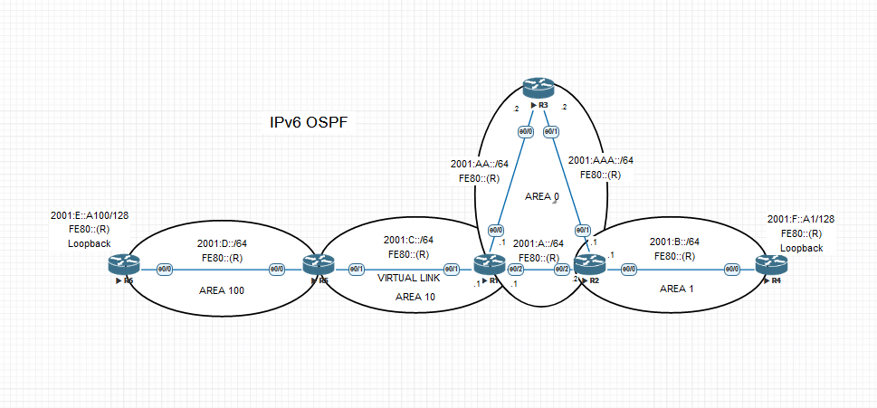

# Работа протокола OSPF для IPv6

## Топология 

## Адресация

| Host | Discription | Interface | IPv6            | Link-local |
|------|-------------|-----------|-----------------|------------|
| R1   | toR3        | e0/0      | 2001:AA::1/64   | FE80::1    |
| R1   | toR5        | e0/1      | 2001:C::1/64    |            |
| R1   | toR2        | e0/2      | 2001:A::1/64    |            |
| R2   | toR4        | e0/0      | 2001:B::1/64    | FE80::2    |
| R2   | toR3        | e0/1      | 2001:AAA::1/64  |            |
| R2   | toR1        | e0/2      | 2001:A::2/64    |            |
| R3   | toR1        | e0/0      | 2001:AA::2/64   | FE80::3    |
| R3   | toR2        | e0/1      | 2001:AAA::2/64  |            |
| R4   | toR2        | e0/0      | 2001:B::2/64    | FE80::4    |
| R4   | Loopback    | Lo1       | 2001:F::A1/128  |            |
| R5   | toR6        | e0/0      | 2001:D::1/64    | FE80::5    |
| R5   | toR1        | e0/1      | 2001:C::2/64    |            |
| R6   | toR5        | e0/0      | 2001:D::2/64    | FE80::6    |
| R6   | Loopback    | Lo1       | 2001:E::A100/64 |            |

## Задачи

1. Настроить OSPF для IPv6, сохранив ту же логику работы(метрики, таймеры, фильтры), что OSPF для IPv4
2. План работы и изменения зафиксированы в документации 

## Настройки маршрутизаторов

### Маршрутизатор R1

    interface Ethernet0/0
     no ip address
     ipv6 address FE80::1 link-local
     ipv6 address 2001:AA::1/64
     ipv6 ospf 1 area 0
    !
    interface Ethernet0/1
     no ip address
     ipv6 address FE80::1 link-local
     ipv6 address 2001:C::1/64
     ipv6 ospf 1 area 10
    !
    interface Ethernet0/2
     no ip address
     ipv6 address FE80::1 link-local
     ipv6 address 2001:A::1/64
     ipv6 ospf 1 area 0
    !
    ipv6 router ospf 1
     router-id 1.1.1.1
     area 10 virtual-link 5.5.5.5
    ************ Таблица маршрутизации IPv6**********

    R1#sh ipv6 route os
    OI  2001:B::/64 [110/20]
         via FE80::2, Ethernet0/2
    O   2001:C::2/128 [110/10]
         via FE80::5, Ethernet0/1
    OI  2001:D::/64 [110/20]
         via FE80::5, Ethernet0/1
    OI  2001:E::A100/128 [110/20]
         via FE80::5, Ethernet0/1
    OI  2001:F::A1/128 [110/20]
         via FE80::2, Ethernet0/2
    O   2001:AAA::/64 [110/20]
         via FE80::3, Ethernet0/0
         via FE80::2, Ethernet0/2

### Маршрутизатор R2

    interface Ethernet0/0
     no ip address
     ipv6 address FE80::2 link-local
     ipv6 address 2001:B::1/64
     ipv6 ospf 1 area 1
    !
    interface Ethernet0/1
     no ip address
     ipv6 address FE80::2 link-local
     ipv6 address 2001:AAA::1/64
     ipv6 ospf 1 area 0
    !
    interface Ethernet0/2
     no ip address
     ipv6 address FE80::2 link-local
     ipv6 address 2001:A::2/64
     ipv6 ospf 1 area 0
    !
    ipv6 router ospf 1
     router-id 2.2.2.2
     ************ Таблица маршрутизации IPv6**********
     R2#sh ipv6 route ospf
    OI  2001:C::/64 [110/20]
         via FE80::1, Ethernet0/2
    OI  2001:C::1/128 [110/10]
         via FE80::1, Ethernet0/2
    OI  2001:C::2/128 [110/20]
         via FE80::1, Ethernet0/2
    OI  2001:D::/64 [110/30]
         via FE80::1, Ethernet0/2
    OI  2001:E::A100/128 [110/30]
         via FE80::1, Ethernet0/2
    O   2001:F::A1/128 [110/10]
         via FE80::4, Ethernet0/0
    O   2001:AA::/64 [110/20]
         via FE80::3, Ethernet0/1
         via FE80::1, Ethernet0/2

### Маршрутизатор R3

    interface Ethernet0/0
     no ip address
     ipv6 address FE80::3 link-local
     ipv6 address 2001:AA::2/64
     ipv6 ospf 1 area 0
    !
    interface Ethernet0/1
     no ip address
     ipv6 address FE80::3 link-local
     ipv6 address 2001:AAA::2/64
     ipv6 ospf 1 area 0
    !
    ipv6 router ospf 1
     router-id 3.3.3.3
     ************ Таблица маршрутизации IPv6**********
     R3#sh ipv6 route ospf
    O   2001:A::/64 [110/20]
         via FE80::2, Ethernet0/1
         via FE80::1, Ethernet0/0
    OI  2001:B::/64 [110/20]
         via FE80::2, Ethernet0/1
    OI  2001:C::/64 [110/20]
         via FE80::1, Ethernet0/0
    OI  2001:C::1/128 [110/10]
         via FE80::1, Ethernet0/0
    OI  2001:C::2/128 [110/20]
         via FE80::1, Ethernet0/0
    OI  2001:D::/64 [110/30]
         via FE80::1, Ethernet0/0
    OI  2001:E::A100/128 [110/30]
         via FE80::1, Ethernet0/0
    OI  2001:F::A1/128 [110/20]
         via FE80::2, Ethernet0/1

### Маршрутизатор R4

    interface Loopback1
     no ip address
     ipv6 address FE80::4 link-local
     ipv6 address 2001:F::A1/128
     ipv6 ospf 1 area 1
    !
    interface Ethernet0/0
     no ip address
     ipv6 address FE80::4 link-local
     ipv6 address 2001:B::2/64
     ipv6 ospf 1 area 1
    !
    ipv6 router ospf 1
     router-id 4.4.4.4
     ************ Таблица маршрутизации IPv6**********
     R4#sh ipv6 route os
    OI  2001:A::/64 [110/20]
         via FE80::2, Ethernet0/0
    OI  2001:C::/64 [110/30]
         via FE80::2, Ethernet0/0
    OI  2001:C::1/128 [110/20]
         via FE80::2, Ethernet0/0
    OI  2001:C::2/128 [110/30]
         via FE80::2, Ethernet0/0
    OI  2001:D::/64 [110/40]
         via FE80::2, Ethernet0/0
    OI  2001:E::A100/128 [110/40]
         via FE80::2, Ethernet0/0
    OI  2001:AA::/64 [110/30]
         via FE80::2, Ethernet0/0
    OI  2001:AAA::/64 [110/20]
         via FE80::2, Ethernet0/0

### Маршрутизатор R5

    interface Ethernet0/0
     no ip address
     ipv6 address FE80::5 link-local
     ipv6 address 2001:D::1/64
     ipv6 ospf 1 area 100
    !
    interface Ethernet0/1
     no ip address
     ipv6 address FE80::5 link-local
     ipv6 address 2001:C::2/64
     ipv6 ospf 1 area 10
    !
    ipv6 router ospf 1
     router-id 5.5.5.5
     area 10 virtual-link 1.1.1.1
     ************ Таблица маршрутизации IPv6**********
     R5#sh ipv6 route os
    O   2001:A::/64 [110/20]
         via FE80::1, Ethernet0/1
    OI  2001:B::/64 [110/30]
         via FE80::1, Ethernet0/1
    O   2001:C::1/128 [110/10]
         via FE80::1, Ethernet0/1
    O   2001:E::A100/128 [110/10]
         via FE80::6, Ethernet0/0
    OI  2001:F::A1/128 [110/30]
         via FE80::1, Ethernet0/1
    O   2001:AA::/64 [110/20]
         via FE80::1, Ethernet0/1
    O   2001:AAA::/64 [110/30]
         via FE80::1, Ethernet0/1

     
### Маршрутизатор R6

    interface Loopback1
     no ip address
     ipv6 address FE80::6 link-local
     ipv6 address 2001:E::A100/128
     ipv6 ospf 1 area 100
    !
    interface Ethernet0/0
     no ip address
     ipv6 address FE80::6 link-local
     ipv6 address 2001:D::2/64
     ipv6 ospf 1 area 100
    !
    ipv6 router ospf 1
     router-id 6.6.6.6
     ************ Таблица маршрутизации IPv6**********
     R6#sh ipv6 route os
    OI  2001:A::/64 [110/30]
         via FE80::5, Ethernet0/0
    OI  2001:B::/64 [110/40]
         via FE80::5, Ethernet0/0
    OI  2001:C::/64 [110/20]
         via FE80::5, Ethernet0/0
    OI  2001:C::1/128 [110/20]
         via FE80::5, Ethernet0/0
    OI  2001:C::2/128 [110/10]
         via FE80::5, Ethernet0/0
    OI  2001:F::A1/128 [110/40]
         via FE80::5, Ethernet0/0
    OI  2001:AA::/64 [110/30]
         via FE80::5, Ethernet0/0
    OI  2001:AAA::/64 [110/40]
         via FE80::5, Ethernet0/0

### Тестирование соединения между Loopback адресами маршрутизаторов R4 и R6

    R6#ping 2001:F::A1
    Type escape sequence to abort.
    Sending 5, 100-byte ICMP Echos to 2001:F::A1, timeout is 2 seconds:
    !!!!!
    Success rate is 100 percent (5/5), round-trip min/avg/max = 1/1/1 ms

