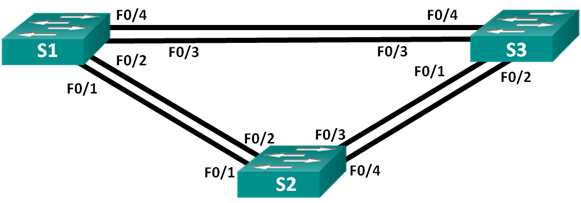

## Лабораторная работа. Развертывание коммутируемой сети с резервными каналами

### Топология

### Таблица адресации

|Заголовок таблицы	 |Интерфейс |IP-адрес	   |Маска подсети|
|:------------------|:---------|:-----------|:------------|
|S1	                |VLAN 1 	  |192.168.1.1 |255.255.255.0|
|S2	                |VLAN 1 	  |192.168.1.2 |255.255.255.0|
|S3	                |VLAN 1 	  |192.168.1.3 |255.255.255.0|

### Цели:

1. Создание сети и настройка основных параметров устройства
2. Выбор корневого моста
3. Наблюдение за процессом выбора протоколом STP порта, исходя из стоимости портов
4. Наблюдение за процессом выбора протоколом STP порта, исходя из приоритета портов

### Часть 1:	Создание сети и настройка основных параметров устройства

#### Шаг 3 Настройте базовые параметры каждого коммутатора
Building configuration...

hostname S1

enable secret 5 $1$mERr$9cTjUIEqNGurQiFU.ZeCi1

no ip domain-lookup

spanning-tree mode pvst

spanning-tree extend system-id

...

interface FastEthernet0/1

...

interface Vlan1

 ip address 192.168.1.1 255.255.255.0
 
banner motd ^C UNAUTHORISED ACCESS PROHIBITED ^C

line con 0
 password 7 0822455D0A16
 logging synchronous
 
line vty 0 4
 password 7 0822455D0A16
 logging synchronous
 login
line vty 5 15

 login
 
#### Шаг 4 Проверьте связь

Успешно ли выполняется эхо-запрос от коммутатора S1 на коммутатор S2? ДА

Успешно ли выполняется эхо-запрос от коммутатора S1 на коммутатор S3? ДА

Успешно ли выполняется эхо-запрос от коммутатора S2 на коммутатор S3? ДА

### Часть 2:	Определение корневого моста

#### Шаг 4 Отобразите данные протокола spanning-tree

S2#sh spanning-tree 

VLAN0001

  Spanning tree enabled protocol ieee
  
  Root ID    Priority    32769
  
             Address     0001.6346.8816
             
             This bridge is the root
             
             Hello Time  2 sec  Max Age 20 sec  Forward Delay 15 sec

  Bridge ID  Priority    32769  (priority 32768 sys-id-ext 1)
  
             Address     0001.6346.8816
             Hello Time  2 sec  Max Age 20 sec  Forward Delay 15 sec
             Aging Time  20
             
|Interface    |    Role Sts Cost |Prio.Nbr Type |
|:------------|:----------------:|:-------------|
|Fa0/4        |    Desg LRN 19   |  128.4    P2p|
|Fa0/2        |    Desg FWD 19   |  128.2    P2p|

Корневым мостов является комутатор S2

Коммутатор S2 был выбран протоколом spanning-tree в качестве корневого моста, так как приоритет у всех трех коммутаторов одинаковый, но S2 имеет наименьший MAC адрес из всех

Корневые порты на коммутаторах:

S1 - Fa0/2

S3 - Fa0/2
  
