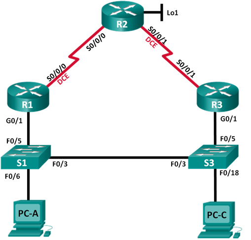

## Лабораторная работа. Настройка HSRP

### Топология

### Таблица адресации

|Устройство	|Интерфейс   |IP-адрес	     |Маска подсети  |Шлюз по умолчанию |
|:----------|:-----------|:--------------|:--------------|:-----------------|
| R1        |G0/1   	   |192.168.1.1    |255.255.255.0  | -                |
|	          |S0/0/0 (DCE)|10.1.1.1       |255.255.255.252| -                |
| R2        |S0/0/0 	   |10.1.1.2       |255.255.255.252| -                |
|           |S0/0/1 (DCE)|10.2.2.2       |255.255.255.252| -                |
|  	        |Lo1         |209.165.200.225|255.255.255.224| -                |
| R3        |G0/1   	   |192.168.1.3    |255.255.255.0  | -                |
|	          |S0/0/1      |10.2.2.1       |255.255.255.252| -                |
| S1        |VLAN 1      |192.168.1.11   |255.255.255.0  | 192.168.1.1      |
| S3        |VLAN 1      |192.168.1.13   |255.255.255.0  | 192.168.1.3      |
| PC-A      |NIC         |192.168.1.31   |255.255.255.0  | 192.168.1.1      |
| PC-C      |NIC         |192.168.1.33   |255.255.255.0  | 192.168.1.3      |

### Задачи

1. Построение сети и проверка соединения
2. Настройка обеспечения избыточности на первом хопе с помощью HSRP

### Часть 1:	Построение сети и проверка связи

Отправьте ping-запрос с компьютера PC-A на компьютер PC-C. Удалось ли получить ответ? ДА

Для настройки RIP на всех маршрутизаторах использовал команды:

        conf t
        router rip
        version 2
        network 10.0.0.0
        network 192.168.1.0
        exit

Вывод команды show ip route на всех маршрутизаторах

R1

    Gateway of last resort is 10.1.1.2 to network 0.0.0.0

         10.0.0.0/8 is variably subnetted, 4 subnets, 3 masks
    R       10.0.0.0/8 is possibly down, routing via 10.1.1.2, Serial0/0/0
    C       10.1.1.0/30 is directly connected, Serial0/0/0
    L       10.1.1.1/32 is directly connected, Serial0/0/0
    R       10.2.2.0/30 [120/1] via 10.1.1.2, 00:00:24, Serial0/0/0
         192.168.1.0/24 is variably subnetted, 2 subnets, 2 masks
    C       192.168.1.0/24 is directly connected, GigabitEthernet0/1
    L       192.168.1.1/32 is directly connected, GigabitEthernet0/1
    R*   0.0.0.0/0 [120/1] via 10.1.1.2, 00:00:24, Serial0/0/0
    
R2

    Gateway of last resort is not set

         10.0.0.0/8 is variably subnetted, 5 subnets, 3 masks
    R       10.0.0.0/8 is possibly down, routing via 10.2.2.1, Serial0/0/1
    C       10.1.1.0/30 is directly connected, Serial0/0/0
    L       10.1.1.2/32 is directly connected, Serial0/0/0
    C       10.2.2.0/30 is directly connected, Serial0/0/1
    L       10.2.2.2/32 is directly connected, Serial0/0/1
    R    192.168.1.0/24 [120/1] via 10.1.1.1, 00:00:08, Serial0/0/0
                        [120/1] via 10.2.2.1, 00:00:12, Serial0/0/1
         209.165.200.0/24 is variably subnetted, 3 subnets, 3 masks
    S       209.165.200.0/24 [1/0] via 209.165.200.224
    C       209.165.200.224/27 is directly connected, Loopback0
    L       209.165.200.225/32 is directly connected, Loopback0

R3

    Gateway of last resort is 10.2.2.2 to network 0.0.0.0

         10.0.0.0/8 is variably subnetted, 4 subnets, 3 masks
    R       10.0.0.0/8 is possibly down, routing via 192.168.1.1, GigabitEthernet0/1
    R       10.1.1.0/30 [120/1] via 10.2.2.2, 00:00:04, Serial0/0/1
    C       10.2.2.0/30 is directly connected, Serial0/0/1
    L       10.2.2.1/32 is directly connected, Serial0/0/1
         192.168.1.0/24 is variably subnetted, 2 subnets, 2 masks
    C       192.168.1.0/24 is directly connected, GigabitEthernet0/1
    L       192.168.1.3/32 is directly connected, GigabitEthernet0/1
    R*   0.0.0.0/0 [120/1] via 10.2.2.2, 00:00:04, Serial0/0/1
    
ping-запросы с компьютера PC-A от каждого интерфейса на маршрутизаторах R1, R2 и R3 завершились удачно

ping-запросы с компьютера PC-C от каждого интерфейса на маршрутизаторах R1, R2 и R3 завершились удачно

### Часть 2:	Настройка обеспечения избыточности на первом хопе с помощью HSRP

#### Шаг 1:	Определите путь интернет-трафика для PC-A и PC-C.

Какой путь прошли пакеты от PC-A до 209.165.200.225? 

        C:\>tracert 209.165.200.225

        Tracing route to 209.165.200.225 over a maximum of 30 hops: 

          1   0 ms      0 ms      3 ms      192.168.1.1
          2   7 ms      1 ms      4 ms      209.165.200.225

        Trace complete.
        
Какой путь прошли пакеты от PC-C до 209.165.200.225?        
        
        C:\>tracert 209.165.200.225

        Tracing route to 209.165.200.225 over a maximum of 30 hops: 

          1   1 ms      0 ms      0 ms      192.168.1.3
          2   13 ms     14 ms     13 ms     209.165.200.225

        Trace complete.

#### Шаг 2:	Запустите сеанс эхо-тестирования на PC-A и разорвите соединение между S1 и R1.

b.	В процессе эхо-тестирования отсоедините кабель Ethernet от интерфейса F0/5 на S1. Отключение интерфейса F0/5 на S1 приведет к тому же результату.
Что произошло с трафиком эхо-запросов? Трафик эхо-запросовв прервался

c.	Какими были бы результате при повторении шагов 2a и 2b на компьютере PC-C и коммутаторе S3? Трафик эхо-запросовв прервался

### Шаг 3:	Настройте HSRP на R1 и R3.

                R1(config)# interface g0/1
                R1(config-if)# standby version 2
                R1(config-if)# standby 1 ip 192.168.1.254
                R1(config-if)# standby 1 priority 150
                R1(config-if)# standby 1 preempt

Вывод

R1

                R1#sh standby 
                GigabitEthernet0/1 - Group 1 (version 2)
                  State is Active
                    7 state changes, last state change 01:44:53
                  Virtual IP address is 192.168.1.254
                  Active virtual MAC address is 0000.0C9F.F001
                    Local virtual MAC address is 0000.0C9F.F001 (v2 default)
                  Hello time 3 sec, hold time 10 sec
                    Next hello sent in 1.135 secs
                  Preemption enabled
                  Active router is local
                  Standby router is 192.168.1.3
                  Priority 150 (configured 150)
                  Group name is hsrp-Gig0/1-1 (default)
                  
R3
 
                R3#sh standby 
                GigabitEthernet0/1 - Group 1 (version 2)
                  State is Speak
                    4 state changes, last state change 01:46:22
                  Virtual IP address is 192.168.1.254
                  Active virtual MAC address is 0000.0C9F.F001
                    Local virtual MAC address is 0000.0C9F.F001 (v2 default)
                  Hello time 3 sec, hold time 10 sec
                    Next hello sent in 1.180 secs
                  Preemption disabled
                  Active router is 192.168.1.1
                  Standby router is unknown
                  Priority 100 (default 100)
                  Group name is hsrp-Gig0/1-1 (default)  
                  
Какой маршрутизатор является активным? R1
Какой MAC-адрес используется для виртуального IP-адреса? 0000.0C9F.F001 
Какой IP-адрес и приоритет используются для резервного маршрутизатора? 192.168.1.254, приоритет 100

e.	Измените адрес шлюза по умолчанию для PC-A, PC-C, S1 и S3. Какой адрес следует использовать? 192.168.1.254

f.	Проверьте новые настройки. Отправьте эхо-запрос с PC-A и с PC-C на loopback-адрес маршрутизатора R2. Успешно ли выполнены эхо-запросы? Да

#### Шаг 4:	Запустите сеанс эхо-тестирования на PC-A и разорвите соединение с коммутатором, подключенным к активному маршрутизатору HSRP (R1).

b.	Во время отправки эхо-запроса отсоедините кабель Ethernet от интерфейса F0/5 на коммутаторе S1 или выключите интерфейс F0/5.
Что произошло с трафиком эхо-запросов? Трафик прервался на два эхо-запроса и затем восстановился

#### Шаг 5:	Проверьте настройки HSRP на маршрутизаторах R1 и R3.

Какой маршрутизатор является активным? R3

Повторно подключите кабель, соединяющий коммутатор и маршрутизатор, или включите интерфейс F0/5. Какой маршрутизатор теперь является активным? Роль активного маршрутизатора переместила на R1? потому что была произведена настройка приоритетного вытеснения

#### Шаг 6:	Изменение приоритетов HSRP.

a.	Измените приоритет HSRP на 200 на маршрутизаторе R3. Какой маршрутизатор является активным? R1

b.	Выполните команду, чтобы сделать активным маршрутизатор R3 без изменения приоритета. Какую команду вы использовали? standby 1 preempt

### Вопросы для повторения
Для чего в локальной сети может потребоваться избыточность?

Избыточность в локальной сети может потребоваться для обеспечения отказоустойчивости сети, высокой доступности приложений и служб.
