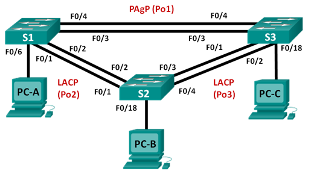

## Лабораторная работа. Настройка EtherChannel

### Топология

### Таблица адресации

|Заголовок таблицы	|Интерфейс |IP-адрес	   |Маска подсети|
|:------------------|:---------|:------------|:------------|
|S1	                |VLAN 99	 |192.168.99.11|255.255.255.0|
|S2	                |VLAN 99	 |192.168.99.12|255.255.255.0|
|S3	                |VLAN 99	 |192.168.99.13|255.255.255.0|
|PC-A	              |NIC	     |192.168.10.1 |255.255.255.0|
|PC-B	              |NIC	     |192.168.20.1 |255.255.255.0|
|PC-C               |NIC	     |192.168.10.2 |255.255.255.0|

### Цели:

1. Настройка базовых параметров коммутатора
2. Настройка PAgP
3. Настройка LACP

#### Шаг 1:	Настройте PAgP на S1 и S3

S1

Команды настройки:

       conf t
       int range f0/1-2
       channel-group 1 mode desirable
       switchport mode trunk
       switchport trunk native vlan 99
       switchport trunk allowed vlan 10,99
Вывод 

       S1#sh etherchannel summary 
        Flags:  D - down        P - bundled in port-channel
        I - stand-alone s - suspended
        H - Hot-standby (LACP only)
        R - Layer3      S - Layer2
        U - in use      f - failed to allocate aggregator
        M - not in use, minimum links not met
        u - unsuitable for bundling
        w - waiting to be aggregated
        d - default port
        Number of channel-groups in use: 1
        Number of aggregators:           1
        Group  Port-channel  Protocol    Ports
        ------+-------------+-----------+-----------------------------------------------
        1      Po1(SU)         PAgP      Fa0/1(P)    Fa0/2(P)    
        
S2

Команды настройки:

       conf t
       int range f0/3-4
       channel-group 1 mode auto
       switchport mode trunk
       switchport trunk native vlan 99
       switchport trunk allowed vlan 10,99

Вывод:

        S3#sh etherchannel summary 
        Flags:  D - down        P - in port-channel
        I - stand-alone s - suspended
        H - Hot-standby (LACP only)
        R - Layer3      S - Layer2
        u - unsuitable for bundling
        U - in use      f - failed to allocate aggregator
        d - default port
        Number of channel-groups in use: 1
        Number of aggregators:           1
        Group  Port-channel  Protocol    Ports
        ------+-------------+-----------+-----------------------------------------------
        1      Po1(SU)         PAgP      Fa0/3(Pd)   Fa0/4(P)    

#### Шаг 2:	Проверьте конфигурации на портах

        S1#sh run interface f0/1
        Building configuration...
        Current configuration : 125 bytes
        !
        interface FastEthernet0/1
        switchport trunk allowed vlan 10,99
        switchport mode trunk
        channel-group 1 mode desirable
        ...
        S1#sh interface f0/2 switchport 
        Name: Fa0/2
        Switchport: Enabled
        Administrative Mode: trunk
        Operational Mode: trunk (member of bundle Po1)
        Administrative Trunking Encapsulation: dot1q
        Operational Trunking Encapsulation: dot1q
        Negotiation of Trunking: On
        Access Mode VLAN: 1 (default)
        Trunking Native Mode VLAN: 1 (default)
        Administrative Native VLAN tagging: enabled
        Voice VLAN: none
        Administrative private-vlan host-association: none 
        Administrative private-vlan mapping: none 
        Administrative private-vlan trunk native VLAN: none
        Administrative private-vlan trunk Native VLAN tagging: enabled
        Administrative private-vlan trunk encapsulation: dot1q
        Administrative private-vlan trunk normal VLANs: none
        Administrative private-vlan trunk associations: none
        Administrative private-vlan trunk mappings: none
        Operational private-vlan: none
        Trunking VLANs Enabled: 10,99
        Pruning VLANs Enabled: 2-1001
        Capture Mode Disabled
        Capture VLANs Allowed: ALL
        Protected: false
        Unknown unicast blocked: disabled
        Unknown multicast blocked: disabled
        Appliance trust: none
        
#### Шаг 3:	Убедитесь, что порты объединены.
      см Шаг 1
      
#### Шаг 4:	Настройте транковые порты.

      S3#sh etherchannel port-channel 
      Channel-group listing: 
      ----------------------
      Group: 1 
      ----------
      Port-channels in the group: 
      ---------------------------
      Port-channel: Po1
      ------------
      Age of the Port-channel   = 0d:00h:22m:22s
      Logical slot/port   = 1/0          Number of ports = 2
      GC                  = 0x00010001      HotStandBy port = null
      Port state          = Port-channel Ag-Inuse 
      Protocol            =   PAgP
      Ports in the Port-channel: 
      Index   Load   Port     EC state        No of bits
      ------+------+------+------------------+-----------
        0     00     Fa0/3    Automatic-Sl       0
        0     00     Fa0/4    Automatic-Sl       0
        
#### Шаг 5:	Убедитесь в том, что порты настроены в качестве транковых.

a.	Выполните команды show run interface идентификатор-интерфейса на S1 и S3. Какие команды включены в список для интерфейсов F0/3 и F0/4 на обоих коммутаторах? Сравните результаты с текущей конфигурацией для интерфейса Po1. Запишите наблюдения.

        S3#sh run interface f0/3
        Building configuration...
        Current configuration : 153 bytes
        !
        interface FastEthernet0/3
         switchport trunk native vlan 99
         switchport trunk allowed vlan 10,99
         switchport mode trunk
         channel-group 1 mode auto

b.	Выполните команды show interfaces trunk и show spanning-tree на S1 и S3. Какой транковый порт включен в список? Какая используется сеть native VLAN? Какой вывод можно сделать на основе выходных данных?

        S1#sh spanning-tree summary 
        Switch is in pvst mode
        Root bridge for: VLAN0001, VLAN0010, VLAN0099
        Extended system ID           is enabled
        Portfast Default             is disabled
        PortFast BPDU Guard Default  is disabled
        Portfast BPDU Filter Default is disabled
        Loopguard Default            is disabled
        EtherChannel misconfig guard is enabled
        UplinkFast                   is disabled
        BackboneFast                 is disabled
        Configured Pathcost method used is short
        Name                   Blocking Listening Learning Forwarding STP Active
        ---------------------- -------- --------- -------- ---------- ----------
        VLAN0001                     0         0        0          2          2
        VLAN0010                     0         0        0          4          4
        VLAN0099                     0         0        0          3          3
        ---------------------- -------- --------- -------- ---------- ----------
        3 vlans  
 
Какие значения стоимости и приоритета порта для агрегированного канала отображены в выходных данных команды show spanning-tree?
       
        Interface           Role Sts Cost      Prio.Nbr Type
        ------------------- ---- --- --------- -------- --------------------------------
        Fa0/3               Desg FWD 19        128.3    P2p 
        Fa0/4               Desg FWD 19        128.4    P2p 
        Po1                 Desg FWD 12        128.64   P2p 
        
### Часть 3:	Настройка протокола LACP

S1

Команды настройки:

       conf t
       int range f0/3-4
       channel-group 2 mode active
       switchport mode trunk
       switchport trunk native vlan 99
       switchport trunk allowed vlan 10,99
Вывод 

        S1#sh etherchannel summary 
        Flags:  D - down        P - bundled in port-channel
                I - stand-alone s - suspended
                H - Hot-standby (LACP only)
                R - Layer3      S - Layer2
                U - in use      f - failed to allocate aggregator
                M - not in use, minimum links not met
                u - unsuitable for bundling
                w - waiting to be aggregated
                d - default port
        Number of channel-groups in use: 2
        Number of aggregators:           2
        Group  Port-channel  Protocol    Ports
        ------+-------------+-----------+-----------------------------------------------
        1      Po1(SU)         PAgP      Fa0/1(P)    Fa0/2(P)    
        2      Po2(SU)         LACP      Fa0/3(P)    Fa0/4(P) 

S3

Команды настройки:

       conf t
       int range f0/1-2
       channel-group 2 mode passive
       switchport mode trunk
       switchport trunk native vlan 99
       switchport trunk allowed vlan 10,99
Вывод 

        
#### Шаг 4:	Проверьте наличие сквозного соединения.

        S3#sh etherchannel summary 
        Flags:  D - down        P - in port-channel
                I - stand-alone s - suspended
                H - Hot-standby (LACP only)
                R - Layer3      S - Layer2
                u - unsuitable for bundling
                U - in use      f - failed to allocate aggregator
                d - default port
        Number of channel-groups in use: 2
        Number of aggregators:           2
        Group  Port-channel  Protocol    Ports
        ------+-------------+-----------+-----------------------------------------------
        1      Po1(SU)         PAgP      Fa0/3(Pd)   Fa0/4(P)    
        2      Po2(SU)         LACP      Fa0/1(Pd)   Fa0/2(P)    
        S3#ping 192168.99.11
        % Unrecognized host or address, or protocol not running.
        S3#ping 192.168.99.11
        Type escape sequence to abort.
        Sending 5, 100-byte ICMP Echos to 192.168.99.11, timeout is 2 seconds:
        !!!!!
        Success rate is 100 percent (5/5), round-trip min/avg/max = 4/4/8 ms
        S3#ping 192.168.99.12
        Type escape sequence to abort.
        Sending 5, 100-byte ICMP Echos to 192.168.99.12, timeout is 2 seconds:
        .!!!!
        Success rate is 80 percent (4/5), round-trip min/avg/max = 1/3/4 ms
