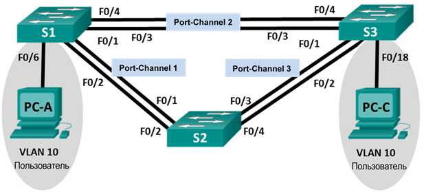

## Лабораторная работа. Поиск и устранение неполадок в работе EtherChannel

### Топология

### Таблица адресации

|Заголовок таблицы	|Интерфейс |IP-адрес	   |Маска подсети|
|:------------------|:---------|:------------|:------------|
|S1	                |VLAN 99	 |192.168.1.11 |255.255.255.0|
|S2	                |VLAN 99	 |192.168.1.12 |255.255.255.0|
|S3	                |VLAN 99	 |192.168.1.13 |255.255.255.0|
|PC-A	              |NIC	     |192.168.0.2  |255.255.255.0|
|PC-C               |NIC	     |192.168.0.3  |255.255.255.0|

### Назначение сети Vlan

|VLAN	           |Имя	         |
|:---------------|:------------|
|10	             |User	       |
|99	             |Управелние	 |

### Задачи

1. Построение сети и загрузка настроек устройств
2. Отладка EtherChannel

### Часть 1:	Построение сети и загрузка настроек устройств

Настройки на устройства были загружены путем копирования параметров настройки из файла лабораторной работы в конфиг устройства. Конфигурация сохранена

### Часть 2:	Поиск и устранение неисправностей в работе EtherChannel

#### Шаг 1:	Выполните поиск и устранение неполадок в работе маршрутизатора S1.

a.	Используйте команду show interfaces trunk, чтобы убедиться в том, что агрегированные каналы работают, как транковые порты.

Отображаются ли агрегированные каналы 1 и 2, как транковые порты? Не отображаются

b.	Используйте команду show etherchannel summary, чтобы убедиться в том, что интерфейсы входят в состав соответствующего агрегированного канала, применен правильный протокол и интерфейсы задействованы.

Команды

      show etherchannel summary
      
Вывод 

      Number of channel-groups in use: 2
      Number of aggregators:           2

      Group  Port-channel  Protocol    Ports
      ------+-------------+-----------+----------------------------------------------

      1      Po1(SD)           LACP   Fa0/1(I) Fa0/2(I) 
      2      Po2(SU)           PAgP   Fa0/3(P) Fa0/4(P) 

Ошибки:  На коммутаторах S1 и S2 агрегированные интерфейсы Po1 используют разные протоколы

d.	Устраните все ошибки, найденные в выходных данных из предыдущих команд show. Запишите команды, используемые для исправления конфигураций.

Интерфейсы F0/1-2 должны использовать протокол агрегации LACP (S1). Интерфейсы F0/3-4 должны использовать протокол PAgP (S1)

Для Po1 на коммутаторах S1 и S2

Команды:

S1

    conf t
    no interface Port-channel 1
    int ra f0/1-2
    sh
    channel-group 1 mode active
    switchport mode trunk
    switchport trunk native vlan 99
    switchport tr allowed vlan 10,99
    no sh

S2 

    conf t
    no interface Port-channel 1
    int ra f0/1-2
    sh
    channel-group 1 mode passive
    switchport mode trunk
    switchport trunk native vlan 99
    switchport tr allowed vlan 10,99
    no sh
    
Вывод:
  
    S2#ping 192.168.1.11
    Type escape sequence to abort.
    Sending 5, 100-byte ICMP Echos to 192.168.1.11, timeout is 2 seconds:
    !!!!!
    Success rate is 100 percent (5/5), round-trip min/avg/max = 0/3/13 ms
    
e.	Используйте команду show interfaces trunk для проверки настроек транковой связи. 

    S1#sh interfaces trunk 
    Port        Mode         Encapsulation  Status        Native vlan
    Po1         on           802.1q         trunking      99
    Port        Vlans allowed on trunk
    Po1         10,99
    Port        Vlans allowed and active in management domain
    Po1         10,99
    Port        Vlans in spanning tree forwarding state and not pruned
    Po1         10,99
    
f.	Используйте команду show etherchannel summary, чтобы убедиться в том, что агрегированные каналы работают и задействованы.

S1

    S1#sh etherchannel summary 
    Flags:  D - down        P - in port-channel
            I - stand-alone s - suspended
            H - Hot-standby (LACP only)
            R - Layer3      S - Layer2
            U - in use      f - failed to allocate aggregator
            u - unsuitable for bundling
            w - waiting to be aggregated
            d - default port

    Number of channel-groups in use: 2
    Number of aggregators:           2

    Group  Port-channel  Protocol    Ports
    ------+-------------+-----------+----------------------------------------------

    1      Po1(SU)           LACP   Fa0/1(P) Fa0/2(P) 
    2      Po2(SU)           PAgP   Fa0/3(P) Fa0/4(P) 
    
    
S2

    S2#sh etherchannel summary 
    Flags:  D - down        P - in port-channel
            I - stand-alone s - suspended
            H - Hot-standby (LACP only)
            R - Layer3      S - Layer2
            U - in use      f - failed to allocate aggregator
            u - unsuitable for bundling
            w - waiting to be aggregated
            d - default port

    Number of channel-groups in use: 2
    Number of aggregators:           2

    Group  Port-channel  Protocol    Ports
    ------+-------------+-----------+----------------------------------------------

    1      Po1(SU)           LACP   Fa0/1(P) Fa0/2(P) 
    3      Po3(SD)           PAgP   Fa0/3(D) Fa0/4(D) 

### Шаг 2:	Выполните поиск и устранение неполадок в работе маршрутизатора S2.

a.	Выполните команду для того, чтобы убедиться, что агрегированные каналы работают в качестве транковых портов. Ниже запишите команду, которую вы использовали.

show interface trunk

Вывод:

            S2#sh interfaces trunk 
            Port        Mode         Encapsulation  Status        Native vlan
            Po1         on           802.1q         trunking      99

            Port        Vlans allowed on trunk
            Po1         10,99

            Port        Vlans allowed and active in management domain
            Po1         10,99

            Port        Vlans in spanning tree forwarding state and not pruned
            Po1         10,99
            
Есть ли в выходных данных сведения о неполадках в конфигурациях? В случае обнаружения неполадок запишите их в отведённом ниже месте.

В конфигурации отсутствует информация об агрегированном канале Po3

b.	Выполните команду, чтобы убедиться в том, что интерфейсы настроены в правильном агрегированном канале и настроен соответствующий протокол.
Есть ли в выходных данных сведения о неполадках в работе EtherChannel? В случае обнаружения неполадок запишите их в отведённом ниже месте.

Вывод:

            Group  Port-channel  Protocol    Ports
            ------+-------------+-----------+----------------------------------------------

            1      Po1(SU)           LACP   Fa0/1(P) Fa0/2(P) 
            3      Po3(SD)           PAgP   Fa0/3(D) Fa0/4(D) 
            
Интерфейсы F0/3 и F0/4 находятся в состоянии shutdown, не совпадает конфигурация Vlan

d.	Устраните все ошибки, найденные в выходных данных из предыдущих команд show. Запишите команды, использованные для исправления настройки.

Команды:
            conf t
            int ra f0/3-4
            sh
            switchport trunk allowed vlan 10,99
            no sh

### Шаг 3:	Выполните поиск и устранение неполадок в работе маршрутизатора S3.

a.	Выполните команду для того, чтобы убедиться, что агрегированные каналы работают в качестве транковых портов.
Есть ли в выходных данных сведения о неполадках в конфигурациях? В случае обнаружения неполадок запишите их в отведённом ниже месте.

Интерфейсы F0/1 и F0/2 находятся в состоянии shutdown, не совпадает конфигурация Vlan

b.	Выполните команду, чтобы убедиться в том, что интерфейсы настроены в правильном агрегированном канале и применен соответствующий протокол.
Есть ли в выходных данных сведения о неполадках в работе EtherChannel? В случае обнаружения неполадок запишите их в отведённом ниже месте.

Вывод: 

            S3#sh etherchannel summary 
            Flags:  D - down        P - in port-channel
                    I - stand-alone s - suspended
                    H - Hot-standby (LACP only)
                    R - Layer3      S - Layer2
                    U - in use      f - failed to allocate aggregator
                    u - unsuitable for bundling
                    w - waiting to be aggregated
                    d - default port

            Number of channel-groups in use: 1
            Number of aggregators:           1

            Group  Port-channel  Protocol    Ports
            ------+-------------+-----------+----------------------------------------------

            3      Po3(SU)           PAgP   Fa0/3(P) Fa0/4(P)

В выходных данных отсутствуют сведения о настройке агрегированного канала Po1

c.	Используйте команду show run | begin interface Port-channel для просмотра текущей конфигурации, начиная с первого интерфейса агрегированного канала.

Недостатки:

1. Интерфейсы F0/1, F0/2 находятся в состоянии shutdown и не настроены для агрегации канала
2. На интерфейсах F0/3, F0/4 не прописаны разрешенные vlan

Решение
            
            conf t
            int Po3
            switchport trunk allowed vlan 10,99
            no sh
            
            
      
