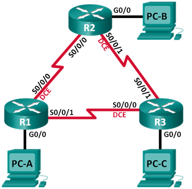

## Лабораторная работа. Настройка базового протокола OSPFv2 для одной области

### Топология

### Таблица адресации

|Устройство	|Интерфейс   |IP-адрес	     |Маска подсети  |Шлюз по умолчанию |
|:----------|:-----------|:--------------|:--------------|:-----------------|
| R1        |G0/0   	   |192.168.1.1    |255.255.255.0  | -                |
|	          |S0/0/0 (DCE)|192.168.12.1   |255.255.255.252| -                |
|	          |S0/0/1      |192.168.13.1   |255.255.255.252| -                |
| R2        |G0/0 	     |192.168.2.1    |255.255.255.0  | -                |
|           |S0/0/0      |192.168.12.2   |255.255.255.252| -                |
|  	        |S0/0/1 (DCE)|192.168.23.1   |255.255.255.252| -                |
| R3        |G0/0   	   |192.168.3.1    |255.255.255.0  | -                |
|	          |S0/0/0 (DCE)|192.168.13.2   |255.255.255.252| -                |
|	          |S0/0/1 (DCE)|192.168.23.2   |255.255.255.252| -                |
| PC-A      |NIC         |192.168.1.3    |255.255.255.0  | 192.168.1.1      |
| PC-B      |NIC         |192.168.2.3    |255.255.255.0  | 192.168.2.1      |
| PC-C      |NIC         |192.168.3.3    |255.255.255.0  | 192.168.3.1      |

### Задачи

1. Создание сети и настройка основных параметров устройства
2. Настройка и проверка маршрутизации OSPF
3. Изменение назначений идентификаторов маршрутизаторов
4. Настройка пассивных интерфейсов OSPF
5. Изменение метрик OSPF

### Часть 1:	Создание сети и настройка основных параметров устройства

#### Шаг 5:	Проверьте связь.

Эхо-запросы между ПК и шлюзами по-умоланию, а также между маршрутизаторами отправляются успешно

### Часть 2:	Настройка и проверка маршрутизации OSPF

#### Шаг 1:	Настройте протокол OSPF на маршрутизаторе R1.

Команды

    R1(config)route ospf 1
    R1(config-router)# network 192.168.1.0 0.0.0.255 area 0
    R1(config-router)# network 192.168.12.0 0.0.0.3 area 0
    R1(config-router)# network 192.168.13.0 0.0.0.3 area 0
  
    
#### Шаг 2:	Настройте OSPF на маршрутизаторах R2 и R3.

    ...
    по аналогии для остальных маршрутизаторов

#### Шаг 3:	Проверьте информацию о соседних устройствах и маршрутизации OSPF.

Команда

    show ip ospf neighbor
    
Вывод

    R1#show ip ospf neighbor 
    Neighbor ID     Pri   State           Dead Time   Address         Interface
    192.168.23.1      0   FULL/  -        00:00:35    192.168.12.2    Serial0/0/0
    192.168.23.2      0   FULL/  -        00:00:35    192.168.13.2    Serial0/0/1

    R2#sh ip ospf neighbor 
    Neighbor ID     Pri   State           Dead Time   Address         Interface
    192.168.23.2      0   FULL/  -        00:00:31    192.168.23.2    Serial0/0/1
    192.168.13.1      0   FULL/  -        00:00:30    192.168.12.1    Serial0/0/0
    
    R3#sh ip ospf neighbor 
    Neighbor ID     Pri   State           Dead Time   Address         Interface
    192.168.13.1      0   FULL/  -        00:00:36    192.168.13.1    Serial0/0/0
    192.168.23.1      0   FULL/  -        00:00:31    192.168.23.1    Serial0/0/1
    
Команда
    
    show ip route
    
 Вывод
 
    R1#
    ...
         192.168.1.0/24 is variably subnetted, 2 subnets, 2 masks
    C       192.168.1.0/24 is directly connected, GigabitEthernet0/0
    L       192.168.1.1/32 is directly connected, GigabitEthernet0/0
    O    192.168.2.0/24 [110/65] via 192.168.12.2, 00:09:16, Serial0/0/0
    O    192.168.3.0/24 [110/65] via 192.168.13.2, 00:08:01, Serial0/0/1
         192.168.12.0/24 is variably subnetted, 2 subnets, 2 masks
    C       192.168.12.0/30 is directly connected, Serial0/0/0
    L       192.168.12.1/32 is directly connected, Serial0/0/0
         192.168.13.0/24 is variably subnetted, 2 subnets, 2 masks
    C       192.168.13.0/30 is directly connected, Serial0/0/1
    L       192.168.13.1/32 is directly connected, Serial0/0/1
         192.168.23.0/30 is subnetted, 1 subnets
    O       192.168.23.0/30 [110/128] via 192.168.12.2, 00:08:01, Serial0/0/0
                            [110/128] via 192.168.13.2, 00:08:01, Serial0/0/1
    
    R2# 
    ...
    O    192.168.1.0/24 [110/65] via 192.168.12.1, 00:12:18, Serial0/0/0
     192.168.2.0/24 is variably subnetted, 2 subnets, 2 masks
    C       192.168.2.0/24 is directly connected, GigabitEthernet0/0
    L       192.168.2.1/32 is directly connected, GigabitEthernet0/0
    O    192.168.3.0/24 [110/65] via 192.168.23.2, 00:11:04, Serial0/0/1
         192.168.12.0/24 is variably subnetted, 2 subnets, 2 masks
    C       192.168.12.0/30 is directly connected, Serial0/0/0
    L       192.168.12.2/32 is directly connected, Serial0/0/0
         192.168.13.0/30 is subnetted, 1 subnets
    O       192.168.13.0/30 [110/128] via 192.168.12.1, 00:11:04, Serial0/0/0
                            [110/128] via 192.168.23.2, 00:11:04, Serial0/0/1
         192.168.23.0/24 is variably subnetted, 2 subnets, 2 masks
    C       192.168.23.0/30 is directly connected, Serial0/0/1
    L       192.168.23.1/32 is directly connected, Serial0/0/1
    
    R3#
    ...
    O    192.168.1.0/24 [110/65] via 192.168.13.1, 00:11:37, Serial0/0/0
    O    192.168.2.0/24 [110/65] via 192.168.23.1, 00:11:37, Serial0/0/1
         192.168.3.0/24 is variably subnetted, 2 subnets, 2 masks
    C       192.168.3.0/24 is directly connected, GigabitEthernet0/0
    L       192.168.3.1/32 is directly connected, GigabitEthernet0/0
         192.168.12.0/30 is subnetted, 1 subnets
    O       192.168.12.0/30 [110/128] via 192.168.23.1, 00:11:37, Serial0/0/1
                            [110/128] via 192.168.13.1, 00:11:37, Serial0/0/0
         192.168.13.0/24 is variably subnetted, 2 subnets, 2 masks
    C       192.168.13.0/30 is directly connected, Serial0/0/0
    L       192.168.13.2/32 is directly connected, Serial0/0/0
         192.168.23.0/24 is variably subnetted, 2 subnets, 2 masks
    C       192.168.23.0/30 is directly connected, Serial0/0/1
    L       192.168.23.2/32 is directly connected, Serial0/0/1
    
Какую команду вы бы применили, чтобы просмотреть в таблице маршрутизации только маршруты OSPF?

Команда 
    show ip route ospf
    
Вывод

    R1#sh ip route ospf
    O    192.168.2.0/24 [110/65] via 192.168.12.2, 00:14:14, Serial0/0/0
    O    192.168.3.0/24 [110/65] via 192.168.13.2, 00:12:59, Serial0/0/1
    O       192.168.23.0/30 [110/128] via 192.168.12.2, 00:12:59, Serial0/0/0
                            [110/128] via 192.168.13.2, 00:12:59, Serial0/0/1
                           
#### Шаг 4:	Проверьте параметры протокола OSPF.

Команда

        show ip protocols
        
Вывод
    
    R1#show ip protocols
    Routing Protocol is "ospf 1"
      Outgoing update filter list for all interfaces is not set 
      Incoming update filter list for all interfaces is not set 
      Router ID 192.168.13.1
      Number of areas in this router is 1. 1 normal 0 stub 0 nssa
      Maximum path: 4
      Routing for Networks:
        192.168.1.0 0.0.0.255 area 0
        192.168.12.0 0.0.0.3 area 0
        192.168.13.0 0.0.0.3 area 0
      Routing Information Sources:  
        Gateway         Distance      Last Update 
        192.168.13.1         110      00:16:50
        192.168.23.1         110      00:16:55
        192.168.23.2         110      00:16:50
      Distance: (default is 110)
      
#### Шаг 5:	Проверьте данные процесса OSPF.

Команда

        sh ip ospf
        
Вывод

         R1#sh ip ospf 
         Routing Process "ospf 1" with ID 192.168.13.1
         Supports only single TOS(TOS0) routes
         Supports opaque LSA
         SPF schedule delay 5 secs, Hold time between two SPFs 10 secs
         Minimum LSA interval 5 secs. Minimum LSA arrival 1 secs
         Number of external LSA 0. Checksum Sum 0x000000
         Number of opaque AS LSA 0. Checksum Sum 0x000000
         Number of DCbitless external and opaque AS LSA 0
         Number of DoNotAge external and opaque AS LSA 0
         Number of areas in this router is 1. 1 normal 0 stub 0 nssa
         External flood list length 0
            Area BACKBONE(0)
                Number of interfaces in this area is 3
                Area has no authentication
                SPF algorithm executed 4 times
                Area ranges are
                Number of LSA 3. Checksum Sum 0x00f26d
                Number of opaque link LSA 0. Checksum Sum 0x000000
                Number of DCbitless LSA 0
                Number of indication LSA 0
                Number of DoNotAge LSA 0
                Flood list length 0

#### Шаг 6:	Проверьте параметры интерфейса OSPF.

Команда
    
    sh ip ospf interface brief (отсутствует в CPT)
    sh ip ospf interface
    
Вывод

        GigabitEthernet0/0 is up, line protocol is up
          Internet address is 192.168.1.1/24, Area 0
          Process ID 1, Router ID 192.168.13.1, Network Type BROADCAST, Cost: 1
          Transmit Delay is 1 sec, State DR, Priority 1
          Designated Router (ID) 192.168.13.1, Interface address 192.168.1.1
          No backup designated router on this network
          Timer intervals configured, Hello 10, Dead 40, Wait 40, Retransmit 5
            Hello due in 00:00:06
          Index 1/1, flood queue length 0
          Next 0x0(0)/0x0(0)
          Last flood scan length is 1, maximum is 1
          Last flood scan time is 0 msec, maximum is 0 msec
          Neighbor Count is 0, Adjacent neighbor count is 0
          Suppress hello for 0 neighbor(s)
        Serial0/0/0 is up, line protocol is up
          Internet address is 192.168.12.1/30, Area 0
          Process ID 1, Router ID 192.168.13.1, Network Type POINT-TO-POINT, Cost: 64
          Transmit Delay is 1 sec, State POINT-TO-POINT,
          Timer intervals configured, Hello 10, Dead 40, Wait 40, Retransmit 5
            Hello due in 00:00:08
          Index 2/2, flood queue length 0
          Next 0x0(0)/0x0(0)
          Last flood scan length is 1, maximum is 1
          Last flood scan time is 0 msec, maximum is 0 msec
          Neighbor Count is 1 , Adjacent neighbor count is 1
            Adjacent with neighbor 192.168.23.1
          Suppress hello for 0 neighbor(s)
        Serial0/0/1 is up, line protocol is up
          Internet address is 192.168.13.1/30, Area 0
          Process ID 1, Router ID 192.168.13.1, Network Type POINT-TO-POINT, Cost: 64
          Transmit Delay is 1 sec, State POINT-TO-POINT,
          Timer intervals configured, Hello 10, Dead 40, Wait 40, Retransmit 5
            Hello due in 00:00:03
          Index 3/3, flood queue length 0
          Next 0x0(0)/0x0(0)
          Last flood scan length is 1, maximum is 1
          Last flood scan time is 0 msec, maximum is 0 msec
          Neighbor Count is 1 , Adjacent neighbor count is 1
            Adjacent with neighbor 192.168.23.2
          Suppress hello for 0 neighbor(s)

#### Шаг 7:	Проверьте наличие сквозного соединения.

Эхо-запросы между ПК отправляются успешно

### Часть 3:	Изменение назначенных идентификаторов маршрутизаторов

#### Шаг 1:	Измените идентификаторы маршрутизатора с помощью loopback-адресов.

a.	Назначьте IP-адрес loopback-интерфейсу 0 для маршрутизатора R1.

Команды

    R1(config)# interface lo0
    R1(config-if)# ip address 1.1.1.1 255.255.255.255
    R1(config-if)# end
    reload

Вывод после перезагрузки

R1#sh ip proto

        R1
        Routing Protocol is "ospf 1"
          Outgoing update filter list for all interfaces is not set 
          Incoming update filter list for all interfaces is not set 
          Router ID 1.1.1.1
          Number of areas in this router is 1. 1 normal 0 stub 0 nssa
          Maximum path: 4
          Routing for Networks:
            192.168.1.0 0.0.0.255 area 0
            192.168.12.0 0.0.0.3 area 0
            192.168.13.0 0.0.0.3 area 0
          Routing Information Sources:  
            Gateway         Distance      Last Update 
            1.1.1.1              110      00:00:09
            2.2.2.2              110      00:00:09
            3.3.3.3              110      00:00:09
            192.168.13.1         110      00:16:41
            192.168.23.1         110      00:01:18
            192.168.23.2         110      00:00:47
          Distance: (default is 110)

f.	Введите команду show ip ospf neighbor, чтобы просмотреть изменения идентификаторов соседних маршрутизаторов.
   
Вывод

        R1#sh ip ospf  neighbor 
        Neighbor ID     Pri   State           Dead Time   Address         Interface
        2.2.2.2           0   FULL/  -        00:00:31    192.168.12.2    Serial0/0/0
        3.3.3.3           0   FULL/  -        00:00:30    192.168.13.2    Serial0/0/1

Шаг 2:	Измените идентификатор маршрутизатора R1 с помощью команды router-id.

Предпочтительным методом настройки идентификатора маршрутизатора является команда router-id.

Команды

    R1(config)# router ospf 1
    R1(config-router)# router-id 11.11.11.11
    Reload or use "clear ip ospf process" command, for this to take effect
    R1(config)# end
    clear ip ospf process
    
Вывод

        R1#sh ip proto
        Routing Protocol is "ospf 1"
          Outgoing update filter list for all interfaces is not set 
          Incoming update filter list for all interfaces is not set 
          Router ID 11.11.11.11
          Number of areas in this router is 1. 1 normal 0 stub 0 nssa
          Maximum path: 4
          Routing for Networks:
            192.168.1.0 0.0.0.255 area 0
            192.168.12.0 0.0.0.3 area 0
            192.168.13.0 0.0.0.3 area 0
          Routing Information Sources:  
            Gateway         Distance      Last Update 
            1.1.1.1              110      00:06:52
            2.2.2.2              110      00:01:09
            3.3.3.3              110      00:00:32
            11.11.11.11          110      00:00:15
            22.22.22.22          110      00:00:18
            33.33.33.33          110      00:00:15
            192.168.13.1         110      00:23:23
            192.168.23.1         110      00:08:00
            192.168.23.2         110      00:07:30
          Distance: (default is 110)
        ...
        R1#sh ip os
        R1#sh ip ospf n
        R1#sh ip ospf neighbor 
        Neighbor ID     Pri   State           Dead Time   Address         Interface
        22.22.22.22       0   FULL/  -        00:00:30    192.168.12.2    Serial0/0/0
        33.33.33.33       0   FULL/  -        00:00:39    192.168.13.2    Serial0/0/1
    

### Часть 4:	Настройка пассивных интерфейсов OSPF

#### Шаг 1:	Настройте пассивный интерфейс.

Команды

    R1(config)# router ospf 1
    R1(config-router)# passive-interface g0/0
    show ip ospf interface g0/0
    
 Вывод
 
     R1#sh ip ospf interface g0/0
    GigabitEthernet0/0 is up, line protocol is up
      Internet address is 192.168.1.1/24, Area 0
      Process ID 1, Router ID 11.11.11.11, Network Type BROADCAST, Cost: 1
      Transmit Delay is 1 sec, State WAITING, Priority 1
      No designated router on this network
      No backup designated router on this network
      Timer intervals configured, Hello 10, Dead 40, Wait 40, Retransmit 5
        No Hellos (Passive interface)
      Index 1/1, flood queue length 0
      Next 0x0(0)/0x0(0)
      Last flood scan length is 1, maximum is 1
      Last flood scan time is 0 msec, maximum is 0 msec
      Neighbor Count is 0, Adjacent neighbor count is 0
      Suppress hello for 0 neighbor(s)

Шаг 2:	Настройте на маршрутизаторе пассивный интерфейс в качестве интерфейса по умолчанию.

Команды 

        R2(config)# router ospf 1
        R2(config-router)# passive-interface default
        ...
        R2(config)# router ospf 1
        R2(config-router)# no passive-interface default

Какой интерфейс использует R3 для маршрута к сети 192.168.2.0/24? Serial0/0/0

Чему равна суммарная метрика стоимости для сети 192.168.2.0/24 на R3? 129

Отображается ли маршрутизатор R2 как соседнее устройство OSPF на маршрутизаторе R1? ДА 

Отображается ли маршрутизатор R2 как соседнее устройство OSPF на маршрутизаторе R3? ДА

Что дает вам эта информация?

Эта информация говорит о том, что маршруты между маршрутизаторами восстановились.

h.	Настройте интерфейс S0/0/1 маршрутизатора R2 так, чтобы разрешить ему объявлять маршруты OSPF. Ниже запишите используемые команды.

Команды
        
        conf t
        int s0/0/1
        ip ospf 1 area 0
        
Какой интерфейс использует R3 для маршрута к сети 192.168.2.0/24? s0/0/1

Чему равна суммарная метрика стоимости для сети 192.168.2.0/24 на маршрутизаторе R3? 65 Как она была рассчитана? Исходя из доступной полосы пропускания последовательного интерфейса и интерфейса g0/0

Отображается ли маршрутизатор R2 как сосед OSPF для маршрутизатора R3? ДА

### Часть 5:	Изменение метрик OSPF

#### Шаг 1:	Измените заданную пропускную способность для маршрутизаторов.

