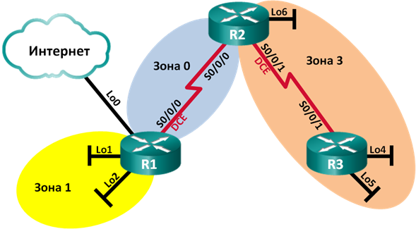

## Лабораторная работа. Настройка OSPFv2 для нескольких областей

### Топология

### Таблица адресации

### Задачи
1. Создание сети и настройка основных параметров устройства
2. Настройка сети OSPFv2 для нескольких областей
3. Настройка межобластных суммарных маршрутов
