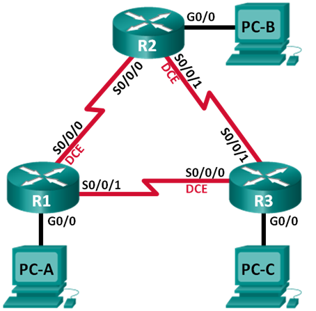

## Базовая настройка протокола EIGRP для IPv4

### Топология

### Таблица адресации

|Устройство	|Интерфейс   |IP-адрес	     |Маска подсети  |Шлюз по-умоланию |
|:----------|:-----------|:--------------|:--------------|:----------------|
| R1        |G0/0  	     |192.168.1.1    |255.255.255.0  | -               |
|	          |S0/0/0(DCE) |10.1.1.1       |255.255.255.252| -               |
|	          |S0/0/1      |10.3.3.1       |255.255.255.252| -               |
| R2        |G0/0  	     |192.168.2.1    |255.255.255.0  | -               |
|           |S0/0/0      |10.1.1.2       |255.255.255.252| -               |
|  	        |S0/0/1 (DCE)|10.2.2.2       |255.255.255.252| -               |
| R3        |G0/0    	   |192.168.3.1    |255.255.255.0  | -               |
|	          |S0/0/0(DCE) |10.3.3.2       |255.255.255.252| -               |
|	          |S0/0/1      |10.2.2.1       |255.255.255.252| -               |
|	PC-A      |NIC         |192.168.1.3    |255.255.255.0  |192.168.1.1      |
|	PC-B      |NIC         |192.168.2.3    |255.255.255.0  |192.168.2.1      |
|	PC-C      |NIC         |192.168.3.3    |255.255.255.0  |192.168.3.1      |

### Задачи

1. Построение сети и проверка соединения
2. Настройка маршрутизации EIGRP
3. Проверка маршрутизации EIGRP
4. Настройка пропускной способности и пассивных интерфейсов

#### Часть 1:	Построение сети и проверка связи

Шаг 5:	Проверьте подключение.

Эхо-запросы между маршрутизаторами, а также между ПК и их шлюзами выполняются успешно

#### Часть 2:	Настройка маршрутизации EIGRP

Команды на R1

    conf t
    router eigrp 10
    network 10.1.1.0 0.0.0.3
    network 192.168.1.0 0.0.0.255
    network 10.3.3.0 0.0.0.3
    
Почему рекомендуется использовать шаблонные маски при объявлении сетей? Можно ли исключить маску в какой-нибудь из вышеприведённых инструкций network? Если да, то в какой (в каких)?

Использование шаблонной маски при объявлении сети необходимо для более точной настройки IP-адрес интерфейса. Если использовать шаблонную маску, то маршрутизатор выполнит поиск интерфейсов, которым назначен адрес в этой сети и включит на них протокол EIGRP. В вышеприведенных инструкциях можно исключить маску для команды network 192.168.1.0, потому что при объявлении сети без шаблонной маски в данном случае маршрутизатор будет использовать классовую адресацию сети.

Шаг 4:	Проверьте наличие сквозного соединения.

В ходе проверки настройки протокола EIGRP на маршрутизаторах R2 и R3 эхо-запросы выполнены успешно

#### Часть 3:	Проверка маршрутизации EIGRP

Шаг 1:	Анализ таблицы соседних устройств EIGRP.

Команда 

    R1#sh ip eig neighbors 
    
Вывод 

    IP-EIGRP neighbors for process 10
    H   Address         Interface      Hold Uptime    SRTT   RTO   Q   Seq
                                       (sec)          (ms)        Cnt  Num
    0   10.1.1.2        Se0/0/0        12   00:04:18  40     1000  0   11
    1   10.3.3.2        Se0/0/1        14   00:02:36  40     1000  0   13
    
Шаг 2:	Проанализируйте таблицу IP-маршрутизации EIGRP.

Вывод

    R1#sh ip route eig
     10.0.0.0/8 is variably subnetted, 5 subnets, 2 masks
    D       10.2.2.0/30 [90/2681856] via 10.1.1.2, 00:05:44, Serial0/0/0
                        [90/2681856] via 10.3.3.2, 00:04:15, Serial0/0/1
         192.168.1.0/24 is variably subnetted, 2 subnets, 2 masks
    D    192.168.2.0/24 [90/2172416] via 10.1.1.2, 00:06:09, Serial0/0/0
    D    192.168.3.0/24 [90/2172416] via 10.3.3.2, 00:04:28, Serial0/0/1
    

Шаг 3:	Проанализируйте таблицу соседних устройств EIGRP.

Вывод

    R1#sh ip eig topology 
    IP-EIGRP Topology Table for AS 10/ID(1.1.1.1)
    Codes: P - Passive, A - Active, U - Update, Q - Query, R - Reply,
           r - Reply status
    P 10.1.1.0/30, 1 successors, FD is 2169856
             via Connected, Serial0/0/0
    P 10.2.2.0/30, 2 successors, FD is 2681856
             via 10.1.1.2 (2681856/2169856), Serial0/0/0
             via 10.3.3.2 (2681856/2169856), Serial0/0/1
    P 10.3.3.0/30, 1 successors, FD is 2169856
             via Connected, Serial0/0/1
    P 192.168.1.0/24, 1 successors, FD is 5120
             via Connected, GigabitEthernet0/0
    P 192.168.2.0/24, 1 successors, FD is 2172416
             via 10.1.1.2 (2172416/5120), Serial0/0/0
    P 192.168.3.0/24, 1 successors, FD is 2172416
             via 10.3.3.2 (2172416/5120), Serial0/0/1
             
Шаг 4:	Проверьте параметры маршрутизации EIGRP и объявленные сети.

Вывод 

        R1#sh ip protocols 
        Routing Protocol is "eigrp  10 " 
          Outgoing update filter list for all interfaces is not set 
          Incoming update filter list for all interfaces is not set 
          Default networks flagged in outgoing updates  
          Default networks accepted from incoming updates 
          Redistributing: eigrp 10
          EIGRP-IPv4 Protocol for AS(10)
            Metric weight K1=1, K2=0, K3=1, K4=0, K5=0
            NSF-aware route hold timer is 240
            Router-ID: 1.1.1.1
            Topology : 0 (base)
              Active Timer: 3 min
              Distance: internal 90 external 170
              Maximum path: 4
              Maximum hopcount 100
              Maximum metric variance 1
          Automatic Summarization: disabled
          Automatic address summarization: 
          Maximum path: 4
          Routing for Networks:  
             10.1.1.0/30
             192.168.1.0
             10.3.3.0/30
          Routing Information Sources:  
            Gateway         Distance      Last Update 
            10.1.1.2        90            5123325    
            10.3.3.2        90            5224943    
          Distance: internal 90 external 170
          
Ответьте на следующие вопросы, используя результаты команды show ip protocols.

Какой номер автономной системы используется? ASN 10

Какие сети объявляются? 10.1.1.0/30, 192.168.1.0, 10.3.3.0/30

Каково значение административной дистанции для маршрутов EIGRP? 90

Сколько маршрутов с равной стоимостью по умолчанию использует EIGRP? 4

#### Часть 4:	Настройка пропускной способности и пассивных интерфейсов

Шаг 1:	Изучите текущие настройки маршрутизации.

Какова пропускная способность по умолчанию для этого последовательного интерфейса? 1544 Kbit

b.	Сколько маршрутов к сети 10.2.2.0/30 содержит таблица маршрутизации? 2 (via 10.1.1.2, via 10.3.3.2)

Шаг 2:	Измените пропускную способность на маршрутизаторах.

Выполните на маршрутизаторе R1 команду show ip route. Появились ли изменения в таблице маршрутизации? Если да, в чем они заключаются? Количество маршрутов к сети 10.2.2.0 сократилось до одного маршрута 
    
        D       10.2.2.0/30 [90/2681856] via 10.1.1.2, 00:00:22, Serial0/0/0

b.	Измените пропускную способность для последовательных интерфейсов маршрутизаторов R2 и R3.

Шаг 3:	Проверьте изменения пропускной способности.

Исходя из заданной пропускной способности, попробуйте определить, как будут выглядеть таблицы маршрутизации маршрутизаторов R2 и R3 до выполнения команды show ip route. Останутся ли их таблицы маршрутизации прежними или изменятся? Изменятся

Шаг 4:	Настройте на маршрутизаторах R1, R2 и R3 интерфейс G0/0 как пассивный.

Команды
    
    conf t
    router eigrp 10
    passive interface g0/0
    
Шаг 5:	Проверьте конфигурацию пассивных интерфейсов.

Вывод 

    R2#sh ip protocols 
    ...
      Routing for Networks:  
         192.168.2.0
         10.1.1.0/30
         10.2.2.0/30
      Passive Interface(s): 
        GigabitEthernet0/0
      ...
      Distance: internal 90 external 170
      
Вопросы для повторения

При выполнении лабораторной работы можно было ограничиться только статической маршрутизацией. Каковы преимущества использования EIGRP? Основным преимуществом протокола в данной топологии является почти мгновенная реакция протокола на изменения в сети

