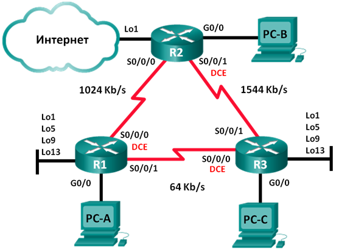

## Настройка расширенных функций EIGRP для IPv4

### Топология

### Таблица адресации

|Устройство	|Интерфейс   |IP-адрес	     |Маска подсети  |Шлюз по-умоланию |
|:----------|:-----------|:--------------|:--------------|:----------------|
| R1        |G0/0  	     |192.168.1.1    |255.255.255.0  | -               |
|	          |S0/0/0(DCE) |192.168.12.1   |255.255.255.252| -               |
|	          |S0/0/1      |192.168.13.1   |255.255.255.252| -               |
|	          |Lo1         |192.168.11.1   |255.255.255.252| Н/Д             |
|	          |Lo5         |192.168.11.5   |255.255.255.252| -               |
|	          |Lo9         |192.168.11.9   |255.255.255.252| -               |
|	          |Lo13        |192.168.11.13  |255.255.255.252| -               |
| R2        |G0/0  	     |192.168.2.1    |255.255.255.0  | -               |
|           |S0/0/0      |192.168.12.2   |255.255.255.252| -               |
|  	        |S0/0/1 (DCE)|192.168.23.1   |255.255.255.252| -               |
|	          |Lo1         |192.168.22.1   |255.255.255.252| -               |
| R3        |G0/0    	   |192.168.3.1    |255.255.255.0  | -               |
|	          |S0/0/0(DCE) |192.168.13.2   |255.255.255.252| -               |
|	          |S0/0/1      |192.168.23.2   |255.255.255.252| -               |
|	          |Lo1         |192.168.33.1   |255.255.255.252| Н/Д             |
|	          |Lo5         |192.168.33.5   |255.255.255.252| -               |
|	          |Lo9         |192.168.33.9   |255.255.255.252| -               |
|	          |Lo13        |192.168.33.13  |255.255.255.252| -               |
|	PC-A      |NIC         |192.168.1.3    |255.255.255.0  |192.168.1.1      |
|	PC-B      |NIC         |192.168.2.3    |255.255.255.0  |192.168.2.1      |
|	PC-C      |NIC         |192.168.3.3    |255.255.255.0  |192.168.3.1      |

### Задачи

 1. Создание сети и настройка основных параметров устройства
 2. Настройка EIGRP и проверка подключения
 3. Настройка EIGRP для автоматического объединения
 4. Настройка и распространение статического маршрута по умолчанию
 5. Выполнение точной настройки EIGRP
 
    •	Настройте параметры использования пропускной способности для EIGRP.
    
    •	Настройте интервал отправки пакетов приветствия (hello) и таймер удержания для EIGRP.

#### Часть 1:	Создание сети и настройка основных параметров устройства

#### Часть 2:	Настройка EIGRP и проверка подключения

##### Шаг 1:	Настройте EIGRP.

a.	На маршрутизаторе R1 настройте маршрутизацию EIGRP с номером автономной системы (AS) 1 для всех сетей с прямым подключением. Запишите использованные команды в поле ниже.

Команды

    conf t
    router eigrp 1
    network 192.168.1.0 0.0.0.255
    network 192.168.12.0 0.0.0.3
    network 192.168.13.0 0.0.0.3
    end
    
b.	Для интерфейса локальной сети маршрутизатора R1 отключите передачу пакетов приветствия (hello) EIGRP. Ниже напишите команду, которую вы использовали.

Команда
  
   passive-interface gi0/0
   
c.	На маршрутизаторе R1 настройте пропускную способность для интерфейса S0/0/0 равной 1024 Кбит/с, а для интерфейса S0/0/1 равной 64 Кбит/с. Запишите использованные команды в поле ниже. Примечание. Команда bandwidth влияет только на вычисление показателя EIGRP, а не на фактическую пропускную способность последовательного канала связи.

Команды

    int s0/0/0
    bandwidth 1024
    int s0/0/1
    bandwidth 64
    
##### Шаг 2:	Проверьте связь.

Эхо-запросы с ПК успешно проходят до всех ПК, а так же до всех интерфейсов маршрутизаторов

#### Часть 3:	Настройка EIGRP для автоматического объединения

