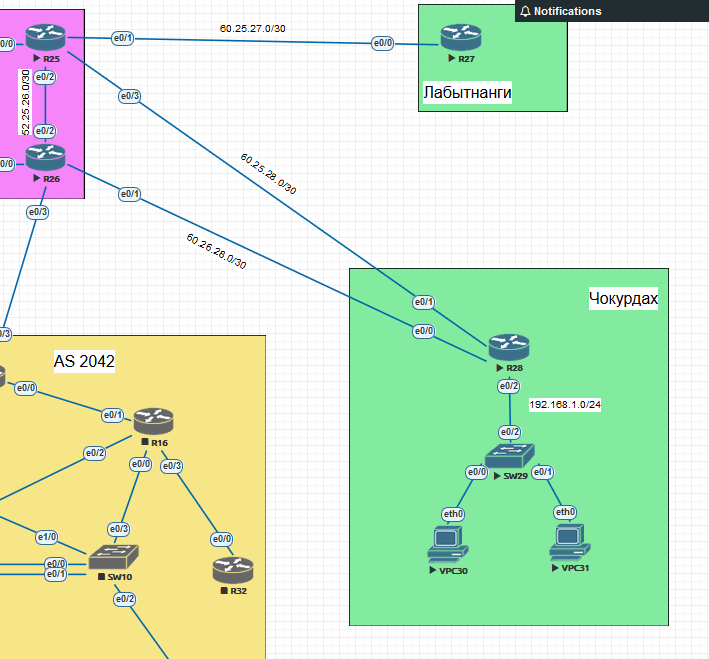

# Маршрутизация на основе политик PBR

## Топология

## Задачи

1. Настроить политику маршрутизации для сетей офиса
2. Распределить трафик между двумя линками с провайдером
3. Настроить отслеживание линка через технологию IP SLA
4. Настройть для офиса Лабытнанги маршрут по-умолчанию
5. План работы и изменения зафиксированы в документации 

## Адресация

| Host  | Interface | Ip-address     |
|-------|-----------|----------------|
| R25   | e0/3      | 60.25.28.1/30  |
| R25   | e0/1      | 60.25.27.1/30  |
| R25   | e0/2      | 52.25.26.1/30  |
| R26   | e0/1      | 60.26.28.1/30  |
| R26   | e0/2      | 52.25.26.2/30  |
| R28   | e0/0      | 60.26.28.2/30  |
| R28   | e0/1      | 60.25.28.2/30  |
| R28   | e0/2      | 192.168.1.1/24 |
| VPC30 |           | 192.168.1.2/24 |
| VPC31 |           | 192.168.1.3/24 |

